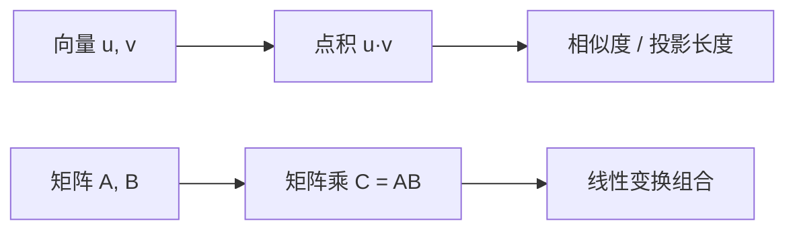

# 向量与矩阵

> **前置知识**：NumPy 基础  
> **预计时间**：60 分钟  
> **本章产出**：理解点积、矩阵乘法

**向量**是有方向的数列；**矩阵**是二维数组。

- 点积 `u·v`：对应元素乘再求和，衡量相似度
- 矩阵乘 `A@B`：线性变换组合
- 转置 `A.T`、行列式 `det(A)`

神经网络每层本质是 `y = Wx + b`。

## 本章图示

### 核心公式

**点积**（衡量两向量相似度）：

$$\mathbf{u} \cdot \mathbf{v} = \sum_{i=1}^{n} u_i v_i = \|\mathbf{u}\| \|\mathbf{v}\| \cos\theta$$

**矩阵乘法**（$A$ 为 $m \times n$，$B$ 为 $n \times p$）：

$$(AB)_{ij} = \sum_{k=1}^{n} A_{ik} B_{kj}$$

**神经网络一层**：$\mathbf{y} = W\mathbf{x} + \mathbf{b}$

## 动手练习

用 NumPy 验证 (AB)C = A(BC)

## 示例文件

- [`examples/part-02-math/01-vectors/main.py`](/examples/part-02-math/01-vectors/main.py) — 本章示例

运行：在仓库根目录执行 `python examples/part-02-math/01-vectors/main.py`；构建后可通过 `docs/public/examples/` 下载。

---

**下一章**：[下一章](/part-02-math/02-derivatives-gradients)
