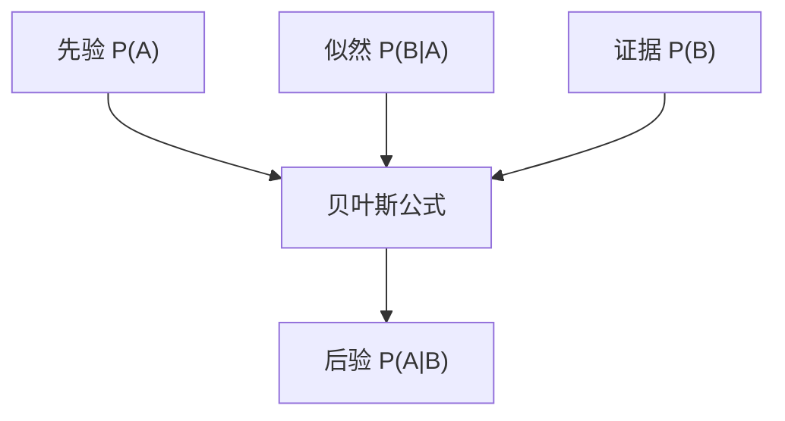

# 概率基础

> **前置知识**：高中数学  
> **预计时间**：45 分钟  
> **本章产出**：理解频率与概率

**概率**描述随机事件可能性，取值 0～1。

大数定律：试验次数越多，频率越接近概率。
**条件概率**、**贝叶斯**在分类与 NLP 中常见。

用模拟验证：掷骰子 10000 次，各面频率约 1/6。

## 本章图示

### 贝叶斯公式

**条件概率**：

$$P(A \mid B) = \frac{P(B \mid A)\, P(A)}{P(B)}$$

**全概率公式**（分母展开）：

$$P(B) = \sum_i P(B \mid A_i)\, P(A_i)$$

在分类任务中，$P(A \mid B)$ 即「观察到特征 $B$ 后，属于类别 $A$ 的概率」——朴素贝叶斯分类器的核心。

## 动手练习

模拟抛硬币 1000 次，画正面频率

## 示例文件

- [`examples/part-02-math/03-probability/main.py`](/examples/part-02-math/03-probability/main.py) — 本章示例

运行：在仓库根目录执行 `python examples/part-02-math/03-probability/main.py`；构建后可通过 `docs/public/examples/` 下载。

---

**下一章**：[下一章](/part-02-math/04-entropy)
