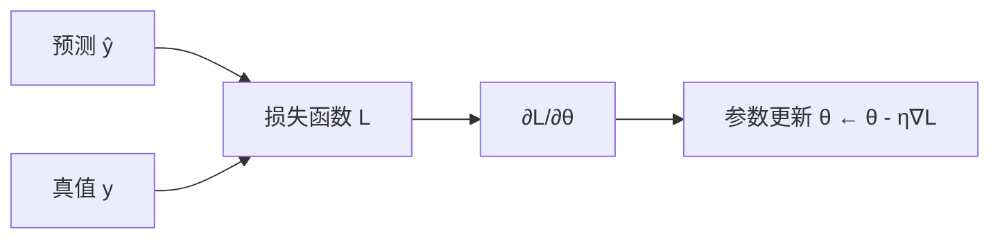

# 损失函数

> **前置知识**：熵、梯度  
> **预计时间**：50 分钟  
> **本章产出**：理解 MSE 与交叉熵

**MSE**：回归预测与真值差的平方均值。

**交叉熵**：分类中衡量预测分布与真实分布差异。

训练目标：最小化损失；优化器用梯度更新参数。

## 本章图示

### 核心公式

**均方误差 MSE**（回归）：

$$\text{MSE} = \frac{1}{n}\sum_{i=1}^{n}(y_i - \hat{y}_i)^2$$

**交叉熵**（二分类）：

$$L = -\big[y \log(\hat{y}) + (1-y)\log(1-\hat{y})\big]$$

**多分类交叉熵**：

$$L = -\sum_{i} y_i \log(\hat{y}_i)$$

其中 $\hat{y}_i$ 为 softmax 输出的类别概率。

## 动手练习

比较同一组 y 下 BCE 与 MSE 数值

## 示例文件

- [`examples/part-02-math/05-loss/main.py`](/examples/part-02-math/05-loss/main.py) — 本章示例

运行：在仓库根目录执行 `python examples/part-02-math/05-loss/main.py`；构建后可通过 `docs/public/examples/` 下载。

---

**下一章**：[下一章](/part-03-ml/01-supervised-unsupervised)
