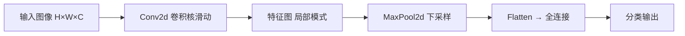

# 卷积神经网络

> **前置知识**：全连接网络  
> **预计时间**：60 分钟  
> **本章产出**：理解卷积与池化

CNN 用局部感受野提取图像特征。

`Conv2d`、`MaxPool2d`、通道数变化。

## 本章图示

**卷积直觉**：小窗口（如 3×3）在整张图上滑动，每次做元素乘加，提取边缘、纹理等局部特征。参数量远小于同等规模的全连接层。

## 动手练习

打印每层输出 shape

## 示例文件

- [`examples/part-04-dl/04-cnn/main.py`](/examples/part-04-dl/04-cnn/main.py) — 本章示例

运行：在仓库根目录执行 `python examples/part-04-dl/04-cnn/main.py`；构建后可通过 `docs/public/examples/` 下载。

---

**下一章**：[下一章](/part-04-dl/05-training-loop)
