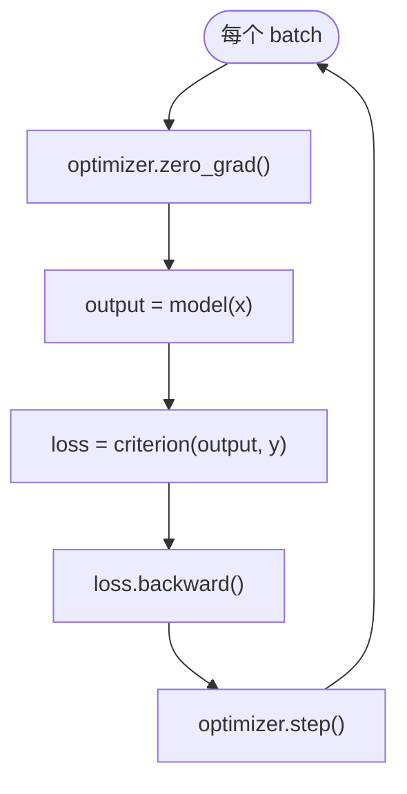

# 训练循环

> **前置知识**：CNN  
> **预计时间**：90 分钟  
> **本章产出**：完整 train/eval 循环

标准四步：`zero_grad` → `forward` → `loss.backward` → `step`

DataLoader 批处理；`model.train()` / `model.eval()`。

## 本章图示

## 动手练习

把 epoch 改成 5 观察 test acc

## 示例文件

- [`examples/part-04-dl/05-training-loop/train_mnist.py`](/examples/part-04-dl/05-training-loop/train_mnist.py) — 本章示例

运行：在仓库根目录执行 `python examples/part-04-dl/05-training-loop/train_mnist.py`；构建后可通过 `docs/public/examples/` 下载。

---

**下一章**：[下一章](/part-04-dl/06-overfitting)
