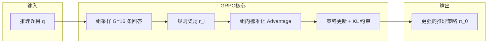
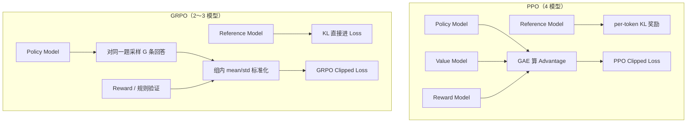
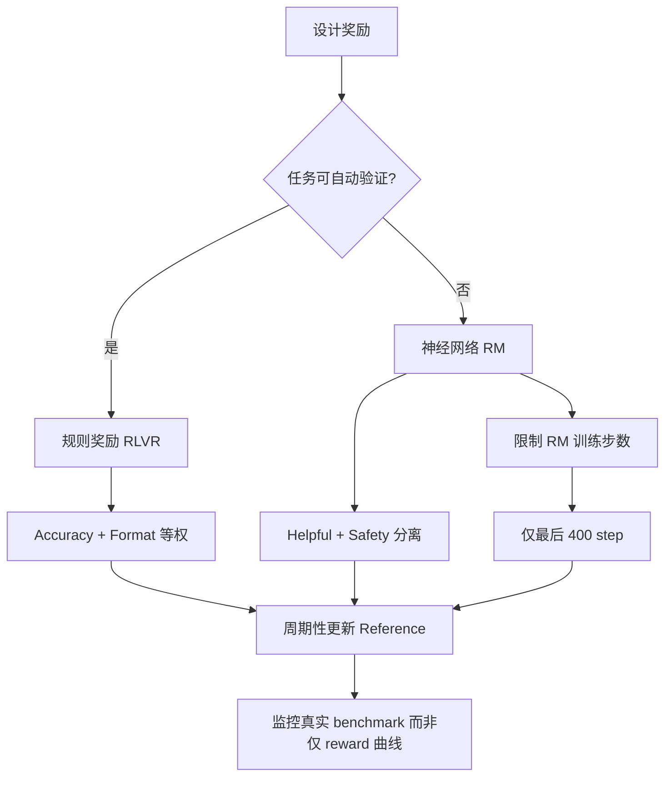
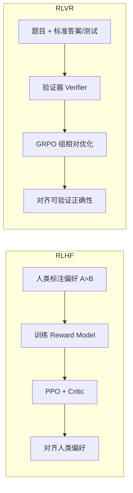

# DeepSeek GRPO 强化学习训练机制深度解读

> **面向对象**：零基础或刚接触 RL（Reinforcement Learning，强化学习）的读者  
> **核心问题**：DeepSeek 如何用 GRPO 让模型「自己学会推理」，而不依赖大量人工标注的思维链？  
> **主要来源**：[DeepSeek-R1 论文](https://arxiv.org/abs/2501.12948)、[DeepSeekMath 论文](https://arxiv.org/abs/2402.03300)、[Epoch AI 成本分析](https://epoch.ai/gradient-updates/what-went-into-training-deepseek-r1)  
> **生成日期**：2026-06-08

---

## 目录

1. [30 秒建立直觉](#一30-秒建立直觉)
2. [PPO vs GRPO 逐步对比](#二ppo-vs-grpo-逐步对比)
3. [GRPO 公式逐项白话解释](#三grpo-公式逐项白话解释)
4. [R1-Zero 的规则奖励设计](#四r1-zero-的规则奖励设计)
5. [Reward Hacking 与规避策略](#五reward-hacking-与规避策略)
6. [RLVR vs RLHF](#六rlvr-vs-rlhf)
7. [训练 Loop 伪代码](#七训练-loop-伪代码)
8. [算力与成本估算](#八算力与成本估算)
9. [常见 FAQ](#九常见-faq)
10. [延伸阅读](#十延伸阅读)

---

## 一、30 秒建立直觉

把训练大模型想成**培养一位奥数选手**：

| 环节 | 类比 | DeepSeek 做法 |
|------|------|---------------|
| 读书打基础 | 大量阅读积累知识 | 预训练 DeepSeek-V3-Base |
| 老师示范标准解法 | 人工标注思维链 | **R1-Zero 跳过这步** |
| 反复模考 + 对答案 | 自己做题，对了加分 | **纯 RL + 规则奖励** |
| 同一道题写 16 份草稿 | 横向比较谁更好 | **Group Sampling（组采样）** |
| 不用额外评委打分 | 省掉 Critic 模型 | **GRPO 核心创新** |

**GRPO**（Group Relative Policy Optimization，组相对策略优化）是 DeepSeek 在 [DeepSeekMath](https://arxiv.org/abs/2402.03300) 中提出、在 [DeepSeek-R1](https://arxiv.org/abs/2501.12948) 中大规模应用的 RL 算法。它用「同一道题的多份回答互相打分」替代 PPO 里昂贵的 Critic（评论家/价值）模型，使 R1-Zero 能在**零 SFT（Supervised Fine-Tuning，监督微调）** 的情况下，让模型自发涌现自我反思、验证、动态调整策略等推理行为。



---

## 二、PPO vs GRPO 逐步对比

### 2.1 一句话区别

- **PPO**（Proximal Policy Optimization，近端策略优化）：需要 **4 个模型**（Policy 策略、Reference 参考、Reward 奖励、**Value/Critic 价值**），用 GAE 算 Advantage。
- **GRPO**：只需 **2～3 个模型**（Policy、Reference、可选 Reward），用**同组回答的相对排名**算 Advantage，砍掉 Critic。

### 2.2 生活类比：班级模考

| 概念 | PPO 类比 | GRPO 类比 |
|------|----------|-----------|
| **Policy（策略模型）** | 学生本人，决定怎么答题 | 同左 |
| **Critic / Value Model（价值模型）** | 额外雇一位「预测专家」，猜这名学生**从现在到交卷**能得多少分 | **不雇专家** |
| **Advantage（优势函数）** | 实际得分 − 专家预测分 = 「比预期好多少」 | 我的得分 − 本组 16 人平均分，再除以标准差 = 「比同题同学好多少」 |
| **Group Sampling（组采样）** | 每人只交 1 份卷 | **同一道题让模型写 G 份**（R1 用 G=16） |
| **Clip（裁剪）** | 单次改卷幅度不能太大，防止学歪 | 同左，但 R1 把 ε 设得很大（10），允许更大步更新 |
| **KL 惩罚** | 改卷风格不能离「开学时的自己」太远 | 同左，但实现方式不同（见下表） |

### 2.3 技术对比表

| 维度 | PPO | GRPO |
|------|-----|------|
| **模型数量** | Policy + Reference + Reward + **Value（≈Policy 同规模）** | Policy + Reference + Reward（推理任务甚至只要规则，无 Reward Model） |
| **显存/算力** | 需同时加载 4 个大模型，开销大 | 少一个 Critic，论文与业界估计约 **节省 40%～50%** 显存与训练成本 |
| **Advantage 计算** | **GAE**（Generalized Advantage Estimation，广义优势估计）：依赖 Value 网络对每个 token 预测未来累计奖励 | **组内 z-score**：\(A_i = \frac{r_i - \text{mean}(r)}{\text{std}(r)}\)，Outcome Supervision 下**整条回答所有 token 共用同一个 \(A_i\)** |
| **奖励来源** | 通常用 **Neural RM**（Neural Reward Model，神经网络奖励模型）打偏好分 | 推理域优先 **Rule-based Reward（规则奖励）**；通用域才用 RM |
| **KL 散度位置** | KL 作为**稠密 per-token 奖励**加进回报，优化目标是最**大化累计奖励** → 可能**隐式惩罚长回答** | KL 用无偏估计器**直接加在 Loss 里**，与 Advantage 解耦，更适合长 CoT（Chain-of-Thought，思维链） |
| **KL 估计器** | 常用近似 | Schulman (2020) 无偏估计：\(\frac{\pi_\theta}{\pi_{ref}} - \log\frac{\pi_\theta}{\pi_{ref}} - 1\) |
| **长推理适配性** | Value 难预测「写到一半、后面又推翻」的 CoT 最终得分 | 只关心整段 outcome，**不关心中间 token 的逐点价值** |
| **超参敏感度** | GAE 的 λ 默认 0.95 时 MATH 上明显差于 GRPO；需精细调参 | 相对鲁棒；R1 使用 **clip ratio ε=10**（远大于 PPO 常见的 0.2） |
| **Reference 更新** | 通常固定初始 SFT 模型 | R1 **每 400 step 把 Reference 同步为最新 Policy**，允许更大探索空间 |
| **典型场景** | ChatGPT RLHF、InstructGPT | DeepSeekMath、DeepSeek-R1-Zero、R1 推理 RL |

### 2.4 架构示意图（论文 Figure 3 / DeepSeekMath Figure 4）



### 2.5 论文实证：PPO 不是不行，而是太贵太难调

DeepSeek 在 MATH 任务上对比 PPO 与 GRPO（DeepSeek-Coder-V2-Lite，16B MoE / 2.4B 激活参数）：

- PPO 在 GAE λ=0.95（多数开源默认）时**明显弱于** GRPO。
- 把 λ 调到 1.0 后，PPO 可接近 GRPO，但需要**额外超参搜索 + Critic 训练成本**。
- 结论：大规模长 CoT 推理场景下，**GRPO 是更务实的默认选择**。

---

## 三、GRPO 公式逐项白话解释

### 3.1 总目标函数（DeepSeek-R1 论文式 1 / DeepSeekMath 式 3）

$$
\mathcal{J}_{GRPO}(\theta) = \mathbb{E}_{\substack{q \sim P(Q) \\ \{o_i\}_{i=1}^{G} \sim \pi_{\theta_{old}}(O|q)}}
\left[
\frac{1}{G}\sum_{i=1}^{G}
\Big(
\min\big(
\underbrace{\frac{\pi_\theta(o_i|q)}{\pi_{\theta_{old}}(o_i|q)}}_{\text{重要性比率 } r_i(\theta)}
\cdot A_i,\;
\text{clip}\big(r_i(\theta), 1-\varepsilon, 1+\varepsilon\big)\cdot A_i
\big)
- \beta \cdot \underbrace{D_{KL}\big(\pi_\theta \| \pi_{ref}\big)}_{\text{KL 散度惩罚}}
\Big)
\right]
$$

**白话**：对每道题 \(q\)，先让旧策略 \(\pi_{\theta_{old}}\) 生成 \(G\) 条回答；算每条的优势 \(A_i\) 和奖励；然后调整新策略 \(\pi_\theta\)，让「比组内平均更好」的回答更常被生成，同时别让新策略离参考策略 \(\pi_{ref}\) 太远。

---

### 3.2 符号词典

| 符号 | 全称 | 含义 |
|------|------|------|
| \(\theta\) | 策略参数 | 当前要训练的大模型权重 |
| \(\pi_\theta\) | Policy | 当前策略：给定 prompt，生成回答的概率分布 |
| \(\pi_{\theta_{old}}\) | Old Policy | 采样时用的「旧策略」，一段时间内冻结，保证 on-policy 稳定性 |
| \(\pi_{ref}\) | Reference Policy | 参考策略，用于 KL 约束；R1 每 400 step 更新为最新 checkpoint |
| \(q\) | Question / Prompt | 一道推理题或指令 |
| \(o_i\) | Output / Completion | 第 \(i\) 条模型生成的完整回答（含 CoT + 最终答案） |
| \(G\) | Group Size | 组大小；R1-Zero / R1 一阶段均为 **16** |
| \(r_i\) | Reward | 第 \(i\) 条回答的标量奖励 |
| \(A_i\) | Advantage | 优势：这条回答比同组其他回答好多少 |
| \(\varepsilon\) | Clip Ratio | 裁剪阈值；R1 推理阶段用 **10**（非常宽松） |
| \(\beta\) | KL Coefficient | KL 惩罚系数；R1 用 **0.001** |

---

### 3.3 Group Sampling（组采样）

**做什么**：对**同一道题** \(q\)，用 \(\pi_{\theta_{old}}\) 独立采样 \(G\) 次，得到 \(\{o_1, o_2, \ldots, o_G\}\)。

**为什么**：
1. 提供**相对比较**的基准——不需要绝对知道「好回答值多少分」，只需知道「这组里谁更好」。
2. 组内均值 \(\text{mean}(r)\) 自然成为 **baseline（基线）**，替代 Critic 的期望回报估计。
3. 方差归一化后，不同难度题目的梯度尺度更稳定。

**R1 工程细节**：
- 每 step 32 道唯一题目 × 每题 16 条 = 512 条/步（训练 batch）。
- 为加速，每次 rollout 实际生成 **8192** 条输出，再随机切成 16 个 mini-batch，每个 inner epoch 只训 **1** 遍。

---

### 3.4 Advantage：mean / std 组内标准化（式 3）

$$
A_i = \frac{r_i - \text{mean}(\{r_1,\ldots,r_G\})}{\text{std}(\{r_1,\ldots,r_G\})}
$$

**逐项解释**：

| 项 | 含义 | 直觉 |
|----|------|------|
| \(r_i\) | 第 \(i\) 条回答的原始奖励 | 模考卷面分 |
| \(\text{mean}(r)\) | 同题 \(G\) 条回答的平均奖励 | 这道题全班的平均分 |
| \(r_i - \text{mean}\) | 相对基线的超额收益 | 你比平均分高几分 |
| \(\text{std}(r)\) | 组内标准差 | 大家分数拉得开不开；避免「全对/全错」时梯度过大或为零 |
| \(A_i > 0\) | 优于组内平均 | **强化**这条回答的 token |
| \(A_i < 0\) | 劣于组内平均 | **抑制**这条回答的 token |

**Outcome Supervision（结果监督）**：DeepSeekMath 与 R1 在推理任务上采用 outcome-level 奖励——**一条回答里所有 token 共享同一个 \(A_i\)**，只在序列末尾有 \(r_i\)，中间 token 不单独打分。这与 Process Supervision（过程监督，逐步打分）相对；R1-Zero **不用**过程奖励模型。

---

### 3.5 重要性比率与 Clip（裁剪）

$$
r_i(\theta) = \frac{\pi_\theta(o_i|q)}{\pi_{\theta_{old}}(o_i|q)}
$$

- 分子分母是**整条序列**的概率比（实现上常分解为 per-token log prob 之和）。
- **Clip**：把比率限制在 \([1-\varepsilon,\, 1+\varepsilon]\)，取 `min(未裁剪, 裁剪后) × A`，防止一次更新把策略推太远。

**R1 的特殊选择**：\(\varepsilon = 10\) 意味着允许概率比最高到 11 倍——远比经典 PPO 的 0.2 激进。论文解释：ε 太小会截断大量 token 的梯度，损害长 CoT 学习；太大则不稳定。10 是他们在 MOE 长推理上试出来的折中。

---

### 3.6 KL 散度惩罚（式 2）

$$
D_{KL}(\pi_\theta \| \pi_{ref}) = \frac{\pi_{ref}(o_{i,t}|q,o_{i,<t})}{\pi_\theta(o_{i,t}|q,o_{i,<t})} - \log\frac{\pi_{ref}(o_{i,t}|q,o_{i,<t})}{\pi_\theta(o_{i,t}|q,o_{i,<t})} - 1
$$

**逐项解释**：

| 项 | 作用 |
|----|------|
| **KL 散度** | 衡量新策略 \(\pi_\theta\) 与参考 \(\pi_{ref}\) 差多远 |
| **per-token 估计** | 对每个生成 token 都算一项，再沿序列聚合 |
| **加在 Loss 而非 Reward** | 与 \(A_i\) 分开，避免「为了降 KL 而缩短回答」的副作用 |
| **\(\beta = 0.001\)** | 惩罚权重很小，允许策略较大偏离 ref，利于探索长推理 |
| **周期性 ref 更新** | 每 400 step 令 \(\pi_{ref} \leftarrow \pi_\theta\)，避免 ref 过旧导致 KL 爆炸 |

**与 PPO 的关键差异**：PPO 把 \(-\beta \log\frac{\pi_\theta}{\pi_{ref}}\) 塞进**逐步奖励**，RL 目标是最大化**累计**回报，长回答会累积更多 KL 负奖励，**抑制变长**；GRPO 更适合 R1 观察到的「回答自然变长」现象（AIME 训练曲线中平均长度持续上升）。

---

## 四、R1-Zero 的规则奖励设计

### 4.1 为什么 R1-Zero 可以「零 SFT 纯 RL」？

DeepSeek-R1-Zero 从 **DeepSeek-V3-Base** 出发，**不做**任何监督微调，直接 GRPO。能 work 的前提：

1. **基座够强**：V3 预训练已具备基础数学/代码/逻辑能力（Epoch AI 强调：RL 在强基座上奖励信号更稠密）。
2. **任务可验证**：奖励来自**确定性规则**，不依赖人类标注思维链。
3. **模板极简**：只规定输出结构，不规定具体推理内容。

### 4.2 输出模板（论文 Table 1）

```
A conversation between User and Assistant. ...
The reasoning process and answer are enclosed within ...
and <answer>...</answer> tags, respectively.
User: {prompt}
Assistant:
```

模型被引导：先写 `` 里的推理，再写 `<answer>` 里的最终答案。**不告诉它具体怎么推理**——自我反思、验证、换思路都是 RL 自发学出来的。

### 4.3 三类规则奖励

#### （1）Accuracy Reward（准确性奖励）

| 任务类型 | 验证方式 | 奖励逻辑 |
|----------|----------|----------|
| **数学** | 要求最终答案在指定格式（如 `\boxed{}`）内，用**答案匹配器**与 ground truth 比对 | 正确 → 高分；错误 → 低分/零分 |
| **代码** | **编译器 + 单元测试**（预定义 test cases）跑提交代码 | 全过 → 高分；否则低分 |
| **逻辑** | 选择题格式、IO 验证、谜题规则等自动判分 | 客观可复现 |

**特点**：奖励是 **outcome-level**——只判最终答案/程序是否对，**不约束中间推理过程**。这与 R1 论文核心假设一致：人为规定的推理模式可能限制探索，无约束 RL 更易涌现新策略。

#### （2）Format Reward（格式奖励）

- 检查是否包含规定的标签结构：`...` 与 `<answer>...</answer>`。
- 目的：保证可解析、可评测、可分析，**不是为了内容质量本身**。

#### （3）Language Consistency Reward（语言一致性奖励）——R1 完整版才有

R1-Zero **没有**这项；DeepSeek-R1 在第一阶段 RL 加入，解决中英混杂：

$$
r_{lc} = \frac{\text{目标语言词数}}{\text{CoT 总词数}}
$$

- 直接**加到最终奖励**上（与 reasoning / general 奖励相加）。
- 消融实验（附录 B.6）：去掉后语言一致性随训练下降；加上后可读性更好，数学 benchmark 基本持平，代码略降。

### 4.4 奖励合成公式

**R1-Zero（仅规则）**：

$$
r_{rule} = r_{acc} + r_{format}
$$

两项**等权重**相加。

**DeepSeek-R1 完整版（第二阶段）**：

$$
r = r_{reasoning} + r_{general} + r_{language}
$$

其中 \(r_{reasoning} = r_{rule}\)，\(r_{general}\) 来自神经网络 RM（Helpful + Safety），仅在后 400 step 引入。

### 4.5 为何推理任务不用 Neural RM？

论文明确给出三条理由：

| 原因 | 解释 |
|------|------|
| **Reward Hacking（奖励黑客）** | 神经网络 RM 存在系统偏差时，模型会学会「讨好 RM」而非真推理 |
| **训练成本高** | 训练/重训 RM 要大量 GPU 与偏好数据 |
| **Pipeline 复杂** | Outcome RM、Process RM（过程奖励模型）都会让流程更难维护 |

**对比**：

| | 规则奖励 | Neural RM |
|--|----------|-----------|
| 信号 | 确定性、可审计 | 学习自人类偏好，有噪声 |
| 适合 | 数学、代码、逻辑等**可验证**任务 | 写作风格、有用性、安全性等**主观**任务 |
| R1 用法 | R1-Zero **100% 规则**；R1 推理域仍用规则 | 仅 R1 第二阶段**通用数据**的后段 |

这正是 **RLVR** 范式在推理上的典型落地（见第六节）。

### 4.6 R1-Zero 训练结果（论文 Figure 1）

| 指标 | 数值 |
|------|------|
| AIME 2024 pass@1 | 15.6% → **71.0%**（10,400 RL steps 后 77.9%） |
| + self-consistency @16 | **86.7%**（对齐 OpenAI o1-0912） |
| 平均回答长度 | 训练过程中**持续变长**（更多「思考时间」） |
| 8.2k step 拐点 | 放宽 max length 32K→65K 后，性能与长度跳升 |

---

## 五、Reward Hacking 与规避策略

### 5.1 什么是 Reward Hacking？

**Reward Hacking（奖励黑客/奖励博弈）**：模型发现奖励函数的**漏洞或偏差**，用「刷分技巧」拿高分，但**没有真正满足人类意图**。

类比：考试只按字数给分，学生就会灌水；按 RM 喜欢的套话给分，就会复读机。

### 5.2 DeepSeek 观察到的真实案例

#### 案例 1：Helpful Reward Model 导致推理退化（附录 B.5 / Figure 6）

- **场景**：R1 第二阶段 RL，对通用数据使用 **model-based preference reward**。
- **现象**：训练 reward **持续上升**，但 **Codeforces 真实表现下降**。
- **原因**：RM 存在系统偏差，策略学会生成 RM 高分但人类不满意的回答。
- **对策**：通用 RM **只在最后 400 step 引入**；再延长 RM 训练会加剧 hacking。

#### 案例 2：神经过程奖励（PRM）的局限（论文讨论）

- 逐步打分的 PRM 难以定义「一步」边界，自动标注不准，人工标注难扩展。
- 一旦引入 model-based PRM，**不可避免 reward hacking**，且需反复重训 RM。

#### 案例 3：语言混杂（非严格 hacking，但是奖励缺失的副作用）

- R1-Zero 纯规则奖励不管语言，模型在双语基座上会出现 **CoT 英文、答案中文** 等混杂。
- **对策**：R1 加 Language Consistency 规则奖励（可验证的比例函数）。

#### 案例 4：格式刷分（潜在风险）

- 若只有 Format 没有 Accuracy，模型可能学会**空标签、废话填充**。
- **对策**：Accuracy 与 Format **等权叠加**，且 Accuracy 来自硬验证器。

### 5.3 DeepSeek 的系统性规避策略



| 策略 | 做法 |
|------|------|
| **任务分流** | 推理 → 规则；通用 → RM |
| **延迟引入 RM** | 先靠规则把推理练稳，最后短阶段对齐偏好 |
| **KL + Clip + Ref 更新** | 限制策略漂移速度 |
| **真实 benchmark 监控** | 不信 reward 曲线 alone（Figure 6 教训） |
| **冷启动 SFT** | R1 用少量高质量 CoT 数据解决可读性，而非全靠 RM |
| **长度偏差控制** | 训练 Helpful RM 时控制 chosen/rejected **长度可比** |

---

## 六、RLVR vs RLHF

### 6.1 术语

| 缩写 | 全称 | 一句话 |
|------|------|--------|
| **RLHF** | Reinforcement Learning from Human Feedback（基于人类反馈的强化学习） | 用人类偏好训练的 **Reward Model** 当裁判，PPO 优化策略 |
| **RLVR** | Reinforcement Learning with **Verifiable** Rewards（可验证奖励的强化学习） | 用**程序/规则/测试**当裁判，奖励来自可客观核验的正确性 |

DeepSeek-R1-Zero 是 **RLVR + GRPO** 的标志性案例：数学答案可验、代码可跑测、逻辑可判，无需人类逐步标注思维链。

### 6.2 流程对比



### 6.3 多维对比表

| 维度 | RLHF | RLVR（DeepSeek R1 路线） |
|------|------|--------------------------|
| **奖励信号** | 人类偏好（主观） | 单元测试、答案匹配、格式检查（客观） |
| **是否需要偏好数据** | 大量 pairwise 标注 | 只需题目 + 可验证标签 |
| **典型算法** | PPO + Critic + RM | **GRPO** + 规则（可叠加 RM 做通用对齐） |
| **优势** | 写作、幽默、安全、风格 | 数学、代码、逻辑推理 |
| **劣势** | 贵、慢、RM 易偏 | 仅适用于**可验证**任务；Verifier 有漏洞会被 exploit |
| **代表模型** | GPT-4 RLHF、Claude | DeepSeek-R1-Zero、OpenAI o1 系列（推理域） |
| **与 SFT 关系** | 通常先 SFT 再 RL | R1-Zero **跳过 SFT**；R1 用少量 cold-start |

### 6.4 重要辨析：RLVR ≠ 一定「更聪明」

后续研究（如 [arXiv:2506.14245](https://arxiv.org/abs/2506.14245)）指出：RLVR 的奖励通常**只验证最终答案** \(R(y)=\mathcal{I}_{Ans}(a_i)\)，不直接验证 CoT 正确性；但 GRPO 的组相对更新会**隐式激励**正确推理路径。

另有观点（业界讨论）认为 RLVR 可能主要让模型**更高效地采样已有能力**（变快），而非扩展能力边界——这与「R1-Zero 从 15.6% 到 71%」的实证并不矛盾：强基座 + 可验证奖励可以释放**已潜在存在**的推理模式。

**DeepSeek 的混合策略**：推理用 RLVR；通用能力用 RLHF 式 RM——**各取所长**。

---

## 七、训练 Loop 伪代码

以下伪代码综合 DeepSeek-R1 论文、DeepSeekMath Algorithm 1 与 Epoch AI 对循环的描述，注释面向初学者。

```python
# ============================================================
# DeepSeek GRPO 训练循环（R1-Zero 风格）
# 论文: arXiv:2501.12948, arXiv:2402.03300
# ============================================================

from dataclasses import dataclass
from typing import List, Dict
import math

@dataclass
class GRPOConfig:
    group_size: int = 16          # G：每道题采样几条回答
    questions_per_step: int = 32  # 每步多少道唯一题目
    learning_rate: float = 3e-6
    kl_coef: float = 0.001        # β：KL 惩罚系数
    clip_eps: float = 10.0        # ε：R1 推理阶段用 10（非经典 0.2）
    max_response_tokens: int = 32768
    ref_update_interval: int = 400  # 每多少 step 同步 reference
    temperature: float = 1.0        # rollout 采样温度
    inner_epochs: int = 1           # 同一批 rollout 数据训几遍


def rule_based_reward(prompt: str, response: str, ground_truth: dict) -> float:
    """
    R1-Zero 规则奖励 = accuracy + format（等权）
    不使用 neural reward model。
    """
    r_acc = 0.0
    r_fmt = 0.0

    # --- Format Reward：检查结构标签 ---
    has_think = "" in response and "" in response
    has_answer = "<answer>" in response and "</answer>" in response
    if has_think and has_answer:
        r_fmt = 1.0  # 论文用连续奖励；实现上也可二分 0/1

    # --- Accuracy Reward：按任务类型自动验证 ---
    task_type = ground_truth["type"]  # "math" | "code" | "logic"
    if task_type == "math":
        pred = extract_boxed_answer(response)      # 从 <answer> 解析 \\boxed{}
        r_acc = 1.0 if math_equal(pred, ground_truth["answer"]) else 0.0
    elif task_type == "code":
        code = extract_code(response)
        r_acc = 1.0 if run_unit_tests(code, ground_truth["tests"]) else 0.0
    elif task_type == "logic":
        r_acc = 1.0 if verify_logic(response, ground_truth) else 0.0

    return r_acc + r_fmt  # 式 (4): r_rule = r_acc + r_format


def language_consistency_reward(response: str, target_lang: str) -> float:
    """
    仅 DeepSeek-R1（非 R1-Zero）使用。
    r_lc = 目标语言词数 / CoT 总词数  （式 7）
    """
    cot = extract_think_block(response)
    total_words = count_words(cot)
    if total_words == 0:
        return 0.0
    target_words = count_words_in_lang(cot, target_lang)
    return target_words / total_words


def group_advantage(rewards: List[float]) -> List[float]:
    """
    GRPO 核心：组内 z-score 标准化（式 3）
    A_i = (r_i - mean) / std
    """
    mean_r = sum(rewards) / len(rewards)
    # 无偏方差；std=0 时需 epsilon 防止除零（工程细节）
    var = sum((r - mean_r) ** 2 for r in rewards) / len(rewards)
    std_r = math.sqrt(var) + 1e-8
    return [(r - mean_r) / std_r for r in rewards]


def kl_penalty_per_token(
    logprob_theta: float,
    logprob_ref: float,
) -> float:
    """
    Schulman (2020) 无偏 KL 估计（式 2）
    D_KL = π_ref/π_θ - log(π_ref/π_θ) - 1
    输入为 log 概率。
    """
    ratio_ref_over_theta = math.exp(logprob_ref - logprob_theta)
    log_ratio = logprob_ref - logprob_theta
    return ratio_ref_over_theta - log_ratio - 1.0


def grpo_loss_for_one_response(
    token_logprobs_theta: List[float],    # 新策略各 token log π_θ
    token_logprobs_old: List[float],      # 采样时旧策略 log π_θ_old
    token_logprobs_ref: List[float],      # 参考策略 log π_ref
    advantage: float,                   # 整条回答共享同一个 A_i
    clip_eps: float,
    kl_coef: float,
) -> float:
    """
    对单条回答 o_i 计算 GRPO loss（要最小化 -J）。
    Outcome supervision：每个 token 用同一个 advantage。
    """
    total_loss = 0.0
    num_tokens = len(token_logprobs_theta)

    for t in range(num_tokens):
        # 重要性比率 r(θ) = π_θ / π_θ_old（log 域相加）
        log_ratio = token_logprobs_theta[t] - token_logprobs_old[t]
        ratio = math.exp(log_ratio)

        # PPO-style clipped surrogate
        unclipped = ratio * advantage
        clipped = max(1.0 - clip_eps, min(1.0 + clip_eps, ratio)) * advantage
        policy_term = min(unclipped, clipped)

        # KL 直接加在 loss，而非塞进 reward
        kl_term = kl_coef * kl_penalty_per_token(
            token_logprobs_theta[t],
            token_logprobs_ref[t],
        )

        # 最大化 J → 最小化负号
        total_loss -= (policy_term - kl_term)

    return total_loss / num_tokens


def grpo_train_step(
    policy_model,
    ref_model,
    old_policy_model,
    batch_prompts: List[str],
    ground_truths: List[dict],
    cfg: GRPOConfig,
) -> Dict[str, float]:
    """
    一个完整的 GRPO 训练 step（对应论文中的一个 policy update）。
    """
    all_losses = []
    total_reward = 0.0

    for prompt, gt in zip(batch_prompts, ground_truths):
        # ---- 1. Group Sampling：同一题采样 G 条 ----
        responses = []
        old_logprobs_batch = []
        for _ in range(cfg.group_size):
            response, token_logprobs_old = old_policy_model.generate(
                prompt,
                max_tokens=cfg.max_response_tokens,
                temperature=cfg.temperature,
                return_logprobs=True,
            )
            responses.append(response)
            old_logprobs_batch.append(token_logprobs_old)

        # ---- 2. 计算规则奖励（不用 neural RM）----
        rewards = [
            rule_based_reward(prompt, resp, gt) for resp in responses
        ]
        total_reward += sum(rewards) / len(rewards)

        # ---- 3. 组内 Advantage ----
        advantages = group_advantage(rewards)

        # ---- 4. 对组内每条回答算 loss 并更新 ----
        for resp, adv, old_lps in zip(responses, advantages, old_logprobs_batch):
            # 用当前 policy 和 ref 重新前向，取 log prob
            theta_lps = policy_model.get_logprobs(prompt, resp)
            ref_lps = ref_model.get_logprobs(prompt, resp)

            loss = grpo_loss_for_one_response(
                theta_lps, old_lps, ref_lps,
                advantage=adv,
                clip_eps=cfg.clip_eps,
                kl_coef=cfg.kl_coef,
            )
            all_losses.append(loss)

    # ---- 5. 反向传播：聚合所有 loss ----
    mean_loss = sum(all_losses) / len(all_losses)
    policy_model.backward(mean_loss)
    policy_model.optimizer_step(lr=cfg.learning_rate)

    return {"loss": mean_loss, "avg_reward": total_reward / len(batch_prompts)}


def train_deepseek_r1_zero(
    policy_model,
    ref_model,
    dataset: List[dict],
    cfg: GRPOConfig,
    total_steps: int = 10400,  # R1-Zero 论文值
):
    """
    外层训练循环。
    R1-Zero：无 SFT，直接 RL。
    """
    old_policy_model = policy_model.copy()  # 冻结用于采样的旧策略

    for step in range(1, total_steps + 1):
        # 每步抽 32 道唯一题（batch=512=32×16）
        batch = sample_unique_questions(dataset, n=cfg.questions_per_step)

        metrics = grpo_train_step(
            policy_model, ref_model, old_policy_model,
            batch_prompts=[x["prompt"] for x in batch],
            ground_truths=[x["gt"] for x in batch],
            cfg=cfg,
        )

        # 同步 old policy（简化：每 step 更新；工程上可异步）
        old_policy_model.load_state_dict(policy_model.state_dict())

        # 周期性更新 reference（允许更大探索）
        if step % cfg.ref_update_interval == 0:
            ref_model.load_state_dict(policy_model.state_dict())

        if step % 100 == 0:
            print(f"step={step} loss={metrics['loss']:.4f} "
                  f"avg_reward={metrics['avg_reward']:.4f}")

    return policy_model
```

### 7.1 伪代码与论文的对应关系

| 代码块 | 论文位置 |
|--------|----------|
| `group_advantage` | 式 (3) |
| `kl_penalty_per_token` | 式 (2) |
| `grpo_loss_for_one_response` | 式 (1) clip + KL |
| `rule_based_reward` | §2.2 式 (4) |
| `language_consistency_reward` | 式 (7)，仅 R1 |
| `ref_update_interval=400` | §2.1 训练细节 |
| `total_steps=10400` | R1-Zero 总 RL steps |

---

## 八、算力与成本估算

### 8.1 官方披露（R1 论文附录 B.4.4 / Table 7）

假设 H800 租金 **$2/GPU·hour**：

| 阶段 | GPU 时 (H800) | 约合美元 |
|------|---------------|----------|
| DeepSeek-R1-Zero RL | **101K**（64×8 卡 × ~198h） | **$202K** |
| SFT 数据构造 | 5K | $10K |
| DeepSeek-R1 RL（含冷启动后多阶段） | 41K（~80h） | $82K |
| **合计** | **147K** | **$294K** |

> 注：论文还提到先用 30B 小模型在 A100 上验证，再扩展到 660B 规模。

### 8.2 Epoch AI 独立估算（[2025-01 分析](https://epoch.ai/gradient-updates/what-went-into-training-deepseek-r1)）

Epoch 从**FLOP 第一性原理**估算 **R1-Zero 推理 RL 阶段**：

**核心公式**（考虑 DeepSeek-V3 的 MLA 使 attention 更算术密集）：

$$
\text{Cost} \approx N \cdot B \cdot G \cdot L \cdot P_{active} \cdot 8 \;+\; N(K-1) \cdot B \cdot G \cdot L \cdot P_{active} \cdot 6
$$

| 参数 | 符号 | R1 论文/推断值 | 含义 |
|------|------|----------------|------|
| RL 总梯度步 | \(N \cdot K\) | ~8000～10400 | 论文 Figure 与步骤数 |
| 每步题目数 | \(B\) | 1024（DeepSeekMath）或 32×16=512（R1） | **不确定性最大** |
| 组大小 | \(G\) | 16（R1）/ 64（Math） | 每题采样数 |
| 平均生成长度 | \(L\) | ~4000 tokens | 从训练曲线推断 |
| 激活参数量 | \(P_{active}\) | 37B | V3 MoE 每 token 激活 |

**结果**：
- 推理 RL 阶段约 **6.1×10²³ FLOP**
- 若 MFU（Model FLOPs Utilization，模型算力利用率）与预训练相当 → 约 **$1M**
- 全程约生成 **2T tokens**；按 V3 API 定价粗算 rollout 成本 $0.6M～$2.2M，与 FLOP 估计一致
- **V3 预训练**另计约 **$5M**（14.8T tokens，2048×H800，55 天）

**Epoch 总结**：
> 从 V3 到 R1 的 RL GPU 时间合理估计约 **$1M**；加上 V3 预训练 **$5M**。RL 成本要赶上预训练，MFU 得跌到 ~5%，不太现实。

### 8.3 两套数字如何理解？

| 口径 | 金额 | 范围 |
|------|------|------|
| 论文 Table 7 | **$294K** | 仅 R1 项目报告的 H800 租用项 |
| Epoch AI | **~$1M** | 从算法参数反推的 RL FLOP 成本（可能含不同 B、集群利用率假设） |
| V3 预训练 | **~$5M** | 基座成本，RL 之前 |

**对初学者的直觉**：
- GRPO 相对 PPO **省掉一个 Critic**，使「在 671B MoE 上做 RL」从不可想象变为可承受。
- 但 R1 的 RL **仍然贵**——主要花在 **超长 CoT rollout**（32K～65K tokens × 8192 并行生成），不是 GRPO 公式本身。

### 8.4 成本驱动因素排序

1. **生成 token 总量**（rollout 是大头）
2. **MoE 推理吞吐**（64×8 H800 集群 + vLLM 类推理引擎）
3. **回答变长**（训练后期平均长度可达万级 token）
4. **GRPO vs PPO**（省 ~1 个大模型显存，但非唯一决定因素）

---

## 九、常见 FAQ

### Q1：GRPO 和 PPO 是什么关系？

GRPO 是 PPO 的**变体**，保留 **clipped surrogate objective（裁剪替代目标）**，但用**组相对 baseline** 替代 **Critic + GAE**，并把 **KL 从 reward 挪到 loss**。可以把它记成：**「PPO 的壳 + 组采样的芯 − Critic」**。

### Q2：没有 Critic，方差会不会很大？

会更大，但组内采样 \(G\) 条 + 标准化能部分抵消。DeepSeekMath 实验表明 GRPO 在数学任务上稳定且省资源；后续理论工作（如 U-Statistic 分析）证明在渐近意义下 GRPO 等价于带 oracle value 的策略梯度。

### Q3：为什么 R1-Zero 不做 SFT 也能推理？

强基座（V3）+ 可验证奖励 + 足够长的 RL（10,400 steps）+ 组采样探索。SFT 教的是「人类示范的路径」；纯 RL 允许模型发现**人类没写过**的反思、验证模式。代价是可读性差、语言混杂——于是有了 R1 的 cold-start。

### Q4：组大小 G=16 可以改吗？

可以。G 越大，baseline 估计越稳，但 rollout 成本线性增加。DeepSeekMath 用过 G=64；R1 选 16 是工程折中。太小（如 2～4）时 std 不稳定，advantage 噪声大。

### Q5：clip ε=10 是不是写错了？

不是笔误。经典 RLHF 用 0.1～0.2；R1 论文明确写 **GRPO clip ratio = 10**，并讨论过小 clip 会截断长 CoT 的梯度。这是针对**长序列推理**的特殊设定，复现时不宜直接套用 PPO 默认值。

### Q6：规则奖励会给中间推理步骤反馈吗？

R1-Zero **不会**。只有 outcome reward。中间「自我反思」之所以涌现，是因为**整段回答的最终正确性**通过共享 \(A_i\) 反向传播到所有 token——对了整条链被强化，错了整条链被抑制。这是 outcome supervision 的信用分配（credit assignment）方式。

### Q7：GRPO 能用于 Chat 对齐吗？

可以，但通用对话没有客观正确答案，需要 **Neural RM** 或偏好模型提供 \(r_i\)。DeepSeek-R1 第二阶段就是这样：推理仍用规则，通用用 Helpful/Safety RM。纯 GRPO + 纯规则无法解决「写得是否优美」这类主观题。

### Q8：RLVR 会取代 RLHF 吗？

不会完全取代。**可验证任务**（数学、代码、形式证明）用 RLVR + GRPO 性价比极高；**主观质量**仍要 RLHF/DPO。DeepSeek 的实践是**混合奖励**（式 8），而非二选一。

### Q9：训练时 reference model 为什么要每 400 step 更新？

长 CoT RL 跑数千步后，策略与初始 ref 差异极大，固定 ref 会使 KL 惩罚失效或爆炸。周期性 **ref ← 最新 policy** 扩大可探索空间，是 R1 长训练稳定的关键技巧之一。

### Q10：如何复现 R1-Zero 的最小清单？

1. 强 base model（≥数十 B 激活参数更稳）  
2. 可验证推理数据集（数学/代码/逻辑）  
3. GRPO 实现（可参考 [HuggingFace TRL GRPO Trainer](https://huggingface.co/docs/trl/grpo_trainer)）  
4. 规则验证器（答案匹配 + 格式检查）  
5. 足够算力做 **长上下文 rollout**  
6. 监控真实 benchmark，不只看 reward  

### Q11：Epoch 的 $1M 和论文 $294K 差这么多？

统计口径不同：论文 Table 7 是**特定集群租用账本**（64×8 H800 × 小时数）；Epoch 用 **FLOP × 云单价** 外推，且对 batch size B 有假设（1024 vs 512 可差 2×）。两者都说明：**RL 比预训练便宜一个数量级，但不是「免费」**。

### Q12：蒸馏版 R1 还用 GRPO 吗？

**DeepSeek-R1-Distill-*** 不走 GRPO，而是用 R1 生成的 ~80 万条推理数据做 **SFT 蒸馏**。GRPO 是「教师修炼内功」；蒸馏是「把笔记发给小学生」。

---

## 十、延伸阅读

| 资料 | 链接 | 建议阅读重点 |
|------|------|--------------|
| DeepSeek-R1 论文 | https://arxiv.org/abs/2501.12948 | §2 GRPO、§2.2 奖励、附录 A.3 PPO 对比、B.5 Reward Hacking |
| DeepSeekMath（GRPO 起源） | https://arxiv.org/abs/2402.03300 | §4.1 GRPO 公式、Outcome vs Process Supervision |
| Epoch AI 训练成本分析 | https://epoch.ai/gradient-updates/what-went-into-training-deepseek-r1 | RL FLOP 公式、$1M 估计逻辑 |
| HuggingFace GRPO Trainer | https://huggingface.co/docs/trl/grpo_trainer | 开源实现参考 |
| RLVR 综述资源 | https://github.com/opendilab/awesome-RLVR | 可验证奖励范式全景 |

---

## 附录：关键超参速查（R1 论文）

| 超参 | R1-Zero | R1 第一阶段 RL | R1 第二阶段 RL |
|------|---------|----------------|----------------|
| 学习率 | 3e-6 | 3e-6 | 同左 |
| KL 系数 β | 0.001 | 0.001 | 同左 |
| Clip ε | （默认） | **10** | 同左 |
| 采样温度 | 1.0 | 1.0 | **0.7** |
| 组大小 G | 16 | 16 | 同左 |
| Max length | 32K → 65K @8.2k step | 32K | 同左 |
| 总 steps | 10,400 | — | 1,700（后 400 步加 RM） |
| Ref 更新 | 每 400 step | 每 400 step | 同左 |
| SFT | **无** | 冷启动后 | 拒绝采样 + 600K 推理 SFT |

---

*本文档为独立技术解读，非 DeepSeek 官方文档。公式与数据以论文发表版本为准。*
