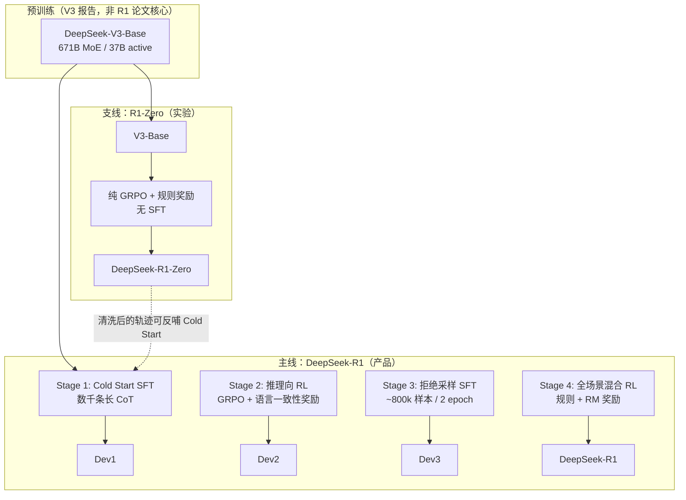
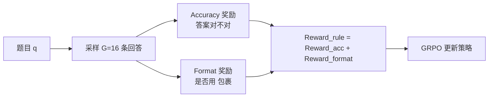
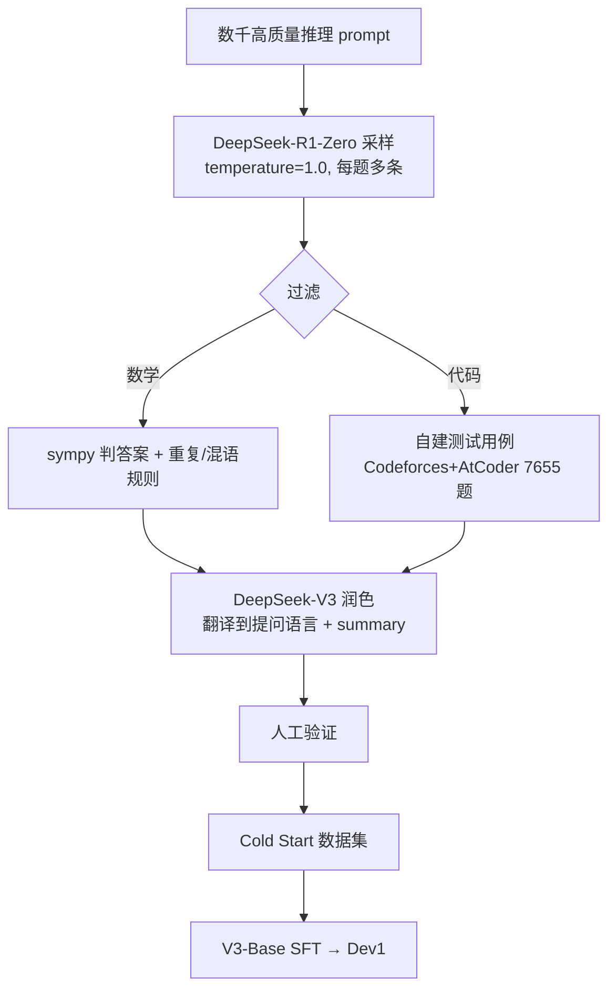
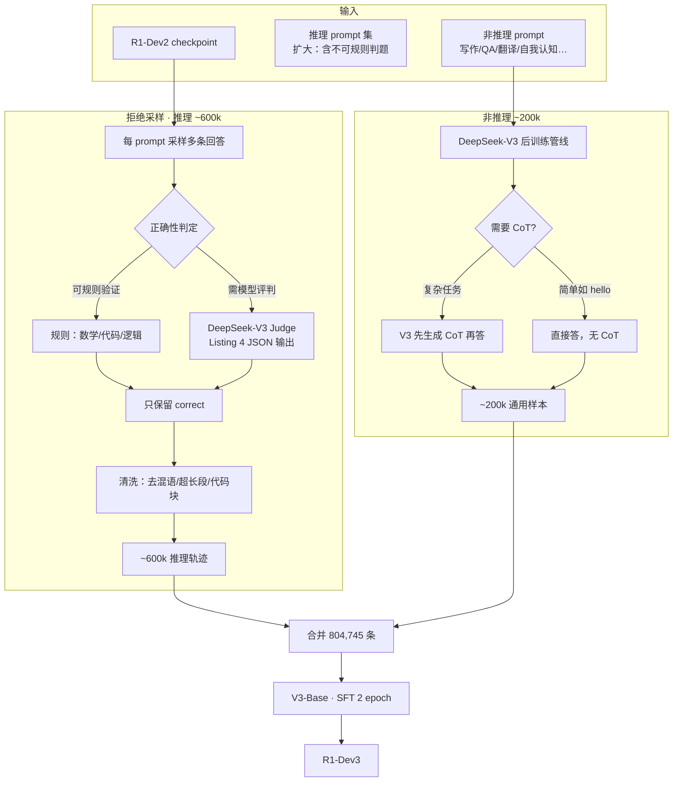
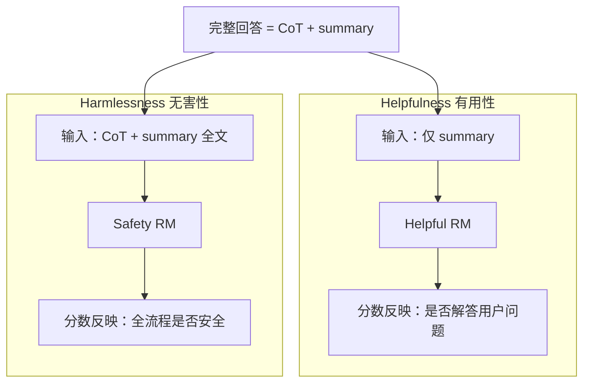
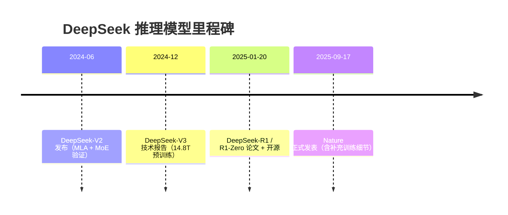

# DeepSeek-R1 完整训练流水线深挖（含 R1-Zero）

> **面向对象**：零基础读者；文中术语首次出现均附解释。  
> **主要来源**：[arXiv 2501.12948](https://arxiv.org/abs/2501.12948) Section 2 / 附录；[Nature s41586-025-09422-z](https://www.nature.com/articles/s41586-025-09422-z) Methods + Supplementary；[Epoch AI 成本分析](https://epoch.ai/gradient-updates/what-went-into-training-deepseek-r1)。  
> **版本说明**：arXiv v1 报告 R1-Zero AIME Pass@1 为 **71.0%**；Nature / arXiv v2 修正为 **77.9%**。本文以 **v2 / Nature** 数字为准，并标注差异。

---

## 目录

1. [30 秒读懂全局](#1-30-秒读懂全局)
2. [术语速查表](#2-术语速查表)
3. [全景流水线图](#3-全景流水线图)
4. [支线：DeepSeek-R1-Zero 完整训练故事](#4-支线deepseek-r1-zero-完整训练故事)
5. [主线：DeepSeek-R1 四阶段详解](#5-主线deepseek-r1-四阶段详解)
6. [Stage 3 拒绝采样：600k + 200k 数据管线](#6-stage-3-拒绝采样600k--200k-数据管线)
7. [Stage 4 混合 RL：Helpfulness vs Harmlessness](#7-stage-4-混合-rlhelpfulness-vs-harmlessness)
8. [与 OpenAI o1 训练路径对比](#8-与-openai-o1-训练路径对比)
9. [完整时间线与各阶段 Benchmark 变化](#9-完整时间线与各阶段-benchmark-变化)
10. [复现 R1-lite：最小可行路径](#10-复现-r1-lite最小可行路径)
11. [官方未公开与失败尝试](#11-官方未公开与失败尝试)
12. [参考资料](#12-参考资料)

---

## 1. 30 秒读懂全局

把训练 R1 想象成培养一位**奥数选手**：

| 角色 | 对应模型 | 一句话 |
|------|----------|--------|
| 读过万卷书的底子 | **DeepSeek-V3-Base** | 671B MoE，每 token 激活 37B；预训练 14.8T token |
| 纯刷题、无人教格式 | **DeepSeek-R1-Zero** | 零 SFT，纯 GRPO + 规则奖励；推理能力**自发涌现** |
| 可上线的产品版 | **DeepSeek-R1** | 四阶段：冷启动 → 推理 RL → 80 万 SFT → 混合 RL |

**核心结论（论文原意）**：

- 推理能力可以主要靠 **RL（强化学习）** 激励出来，不必先喂海量人工 CoT。
- 少量 **Cold Start（冷启动）** 数据能让模型更可读、更稳定，并加速收敛。
- 大模型的推理轨迹可以 **蒸馏** 到小模型，往往比在小模型上从头 RL 更划算。

---

## 2. 术语速查表

| 术语 | 英文 | 小白解释 |
|------|------|----------|
| **LLM** | Large Language Model | 大语言模型；读入文字、输出文字 |
| **Base 模型** | Base model | 只做完预训练、还不会「聊天格式」的模型；R1 起点是 **DeepSeek-V3-Base** |
| **SFT** | Supervised Fine-Tuning | 监督微调：用「题目 → 标准答案」配对直接教模型模仿 |
| **RL** | Reinforcement Learning | 强化学习：模型自己生成答案，按打分高低调参数，类似刷题改错 |
| **CoT** | Chain-of-Thought | 思维链：解题时先写中间推理步骤，再给最终答案 |
| **GRPO** | Group Relative Policy Optimization | 组相对策略优化；DeepSeek 提出的 RL 算法，**不用 Critic 价值网络**，用一组采样答案的相对得分算优势，省算力 |
| **PPO** | Proximal Policy Optimization | 近端策略优化；ChatGPT RLHF 常用算法，需 Critic，成本更高 |
| **KL 散度** | Kullback–Leibler divergence | 衡量新策略与参考策略差多远；防止 RL 把模型「训歪」 |
| **Reward / 奖励** | Reward signal | RL 的分数；告诉模型这轮答得好不好 |
| **规则奖励** | Rule-based reward | 用代码/规则自动判对错（数学题抽答案、代码跑测试） |
| **RM** | Reward Model | 奖励模型；神经网络打分，用于难自动验证的开放题 |
| **PRM** | Process Reward Model | 过程奖励模型；给推理**每一步**打分（DeepSeek 尝试过但放弃） |
| **拒绝采样** | Rejection sampling | 同一题采样多个回答，**只保留判为正确**的轨迹当训练数据 |
| **Pass@1** | — | 每题采样 1 次答对的平均比例 |
| **Cons@64** | Consensus @ 64 | 每题采样 64 次，用**多数票**决定对错后的准确率 |
| **Test-time scaling** | 测试时扩展算力 | 推理时让模型「想更久」——生成更长 CoT，往往更准确 |
| **Reflection** | 反思 | 模型中途回头检查前面步骤，发现错误后重写 |
| **Cold Start** | 冷启动 | RL 前用少量高质量长 CoT 做 SFT，避免 RL 初期失控 |
| **MoE** | Mixture of Experts | 混合专家；671B 总参数，每 token 只激活约 37B |
| **Helpfulness** | 有用性 | 回答是否真正帮用户解决问题 |
| **Harmlessness** | 无害性 | 回答是否安全、无偏见、无有害内容 |

---

## 3. 全景流水线图

### 3.1 两条路线总览



### 3.2 中间 Checkpoint 命名（Nature Fig. 2）

| 代号 | 对应阶段结束 | 含义 |
|------|--------------|------|
| **R1-Zero** | 纯 RL 支线终点 | 无 Cold Start |
| **R1-Dev1** | Stage 1 结束 | Cold Start SFT 后 |
| **R1-Dev2** | Stage 2 结束 | 推理向 RL 收敛后 |
| **R1-Dev3** | Stage 3 结束 | 80 万样本 SFT 后 |
| **R1** | Stage 4 结束 | 最终模型 |

---

## 4. 支线：DeepSeek-R1-Zero 完整训练故事

> 论文 Section **2.2**；Nature **DeepSeek-R1-Zero** 节 + Methods。

### 4.1 设计哲学：故意「少教」

R1-Zero 的核心实验问题：

> **能否完全不喂人工推理轨迹，仅靠 RL 让 Base 模型自己长出推理能力？**

因此：

- **不做 SFT**（零冷启动数据）
- **不用神经网络 Reward Model**（避免 reward hacking / 奖励黑客）
- 模板里**只规定输出结构**，不规定必须反思、必须验算等具体内容

### 4.2 训练模板（Table 1）

论文规定的唯一格式约束：

```text
A conversation between User and Assistant. The user asks a question, and the Assistant solves it.
The assistant first thinks about the reasoning process in the mind and then provides the user
with the answer. The reasoning process and answer are enclosed within  and 
tags, respectively, i.e.,  reasoning process here  answer here.
User: {prompt}. Assistant:
```

| 设计选择 | 目的 |
|----------|------|
| 先 `` 再给答案 | 强制模型把推理与最终输出分开 |
| 不写「你必须反思」 | 观察 RL 下**自然涌现**的行为 |
| 数学题 / 代码 / 逻辑 | 奖励可**规则自动验证** |

> **注**：开源权重里特殊 token 名称以 HuggingFace 为准；论文排版中 `` / `` 为推理与答案分隔标记。

### 4.3 奖励设计（2.2.2）



| 奖励类型 | 怎么判 | 例子 |
|----------|--------|------|
| **Accuracy** | 确定性任务可自动验证 | 数学题：答案是否在 `\boxed{}` 里且正确；代码：编译器跑测试用例 |
| **Format** | 结构是否符合模板 | 推理段是否出现在规定标签内 |

**刻意不做的事**：

- 不用 Outcome RM / Process RM（神经网络奖励）
- 原因：大规模 RL 下易 **reward hacking**；重训 RM 又贵又复杂

### 4.4 GRPO 算法（2.2.1）一句话

对每个问题采样一组回答 \(\{o_1,\ldots,o_G\}\)，算每条奖励 \(r_i\)，再算**组内相对优势**：

\[
A_i = \frac{r_i - \mathrm{mean}(\{r_j\})}{\mathrm{std}(\{r_j\})}
\]

然后在 PPO 风格目标里最大化期望奖励，并加 **KL 惩罚** 防止偏离参考策略太远。

**与 PPO 的关键区别**：不需要与策略同尺寸的 **Critic 价值网络**，Baseline 来自**同组样本的平均分**。

### 4.5 R1-Zero 训练超参（Nature Methods）

| 参数 | 值 | 解释 |
|------|-----|------|
| 学习率 | 3×10⁻⁶ | 策略网络更新步长 |
| KL 系数 β | 0.001 | 约束别偏离 ref 模型太多 |
| Rollout 温度 | 1.0 | 采样多样性 |
| 每题采样数 G | 16 | GRPO 一组 16 条轨迹 |
| 每步题目数 | 32 | 每 training step 32 道独立题 |
| 每步 batch | 512 | 32 题 × 16 采样 = 512 条轨迹 |
| 最大生成长度 | 32,768 tokens（8.2k 步前）→ **65,536**（之后） | 8.2k 步后放宽长度，性能跳升 |
| 总训练步数 | **10,400 steps**（≈1.6 epoch） | Nature 明确给出 |
| Ref 模型更新 | 每 **400 steps** 换成最新策略 | 防止 KL 约束过时 |
| Rollout 吞吐 | 每轮 8,192 outputs → 16 mini-batch | 只训 1 个 inner epoch 加速 |

**硬件（Supplementary B.4.4）**：

- **512× H800**（64 节点 × 8 卡）训练约 **198 小时**
- 约合 **101K H800 GPU·小时**，按 $2/GPU·h ≈ **$202K**

### 4.6 自发行为：Reflection 与 Test-time Scaling

#### 4.6.1 响应长度自然增长（Figure 3 / Nature Fig. 1b）

- RL 过程中，模型在训练集上的**平均回答长度持续上升**
- 不是人工调 max tokens 逼它写长，而是：**想得更久 → 奖励更高 → 策略强化「长思考」**
- 典型范围：数百到**数千** reasoning tokens

这就是 **test-time scaling（测试时算力扩展）** 的训练侧起源：模型学会在难题上分配更多推理 token。

#### 4.6.2 Reflection（反思）自发出现

论文描述（Section 2.2.4）：

- 模型会**回头重评**先前步骤
- 会**尝试替代解法**
- 会出现 **self-verification（自验证）**
- 这些行为**未写入模板**，是 RL 与规则奖励交互后的涌现策略

Nature Extended Data Fig. 1 统计了反思相关词频（`wait`, `mistake`, `verify`, `check` 等）：

| 训练阶段 | 「wait」等行为 |
|----------|----------------|
| 早期 | 几乎不出现 |
| 4k–7k steps | 零星出现 |
| **8k steps 后** | 频率显著上升（与 max length 提升同步） |

#### 4.6.3 Aha Moment 原文解读（Table 3）

**场景**：中间版本模型解一道含参方程 \(\sqrt{a-\sqrt{a+x}}=x\)（\(a>1\)）时：

1. 模型按常规两边平方、整理成四次方程，一路推导；
2. 突然插入（原文）：
   > **"Wait, wait. Wait. That's an aha moment I can flag here."**
3. 随后写道：**"Let's reevaluate this step-by-step"**，回到起点重新平方、换路径推导。

**三层含义**：

| 层面 | 解读 |
|------|------|
| **模型行为** | 学会在推理中途**主动暂停**、怀疑当前路径并**重启推导**——类似人类「啊，等等，这里不对」 |
| **训练机制** | 未教「何时该反思」；只要最终答案可验证正确，**中间自我纠错**也会被 RL 强化 |
| **研究意义** | 作者称这也是研究者的 aha moment：给对激励，复杂策略可**自主进化** |

> Nature 补充：该现象与 **「wait」词频在 ~8k step 后陡增** 相关，常被视为推理模式相变（phase transition）的经验标志。

### 4.7 R1-Zero 性能与缺点

#### Benchmark（Table 2 / Nature Supplementary）

| 指标 | R1-Zero | 对比 |
|------|---------|------|
| AIME 2024 Pass@1 | **77.9%**（v2）/ 71.0%（v1） | 起点约 **15.6%** |
| AIME Cons@64 / cons@16 | **86.7%** | 接近 o1-0912 |
| MATH-500 | **95.9%** | |
| GPQA Diamond | **73.3%**（arxiv Table 2）/ **75.8%**（Nature Table 2） | |
| LiveCodeBench | **50.0%** | |
| Codeforces Rating | **1444** | |

#### 三大缺点（促使做 R1 主线）

1. **可读性差**：长篇、混乱、难当产品展示  
2. **语言混杂**：中英（及其他语言）在一段 CoT 里混写  
3. **通用能力弱**：写作、开放域 QA 等未专门优化  

---

## 5. 主线：DeepSeek-R1 四阶段详解

> 论文 Section **2.3**；Nature Fig. 2 + Table 2。

### 5.0 四阶段对照总表

| 阶段 | 输入 Checkpoint | 输出 Checkpoint | 数据规模 | 训练目标 | 停止条件 |
|------|-----------------|-----------------|----------|----------|----------|
| **Stage 1** Cold Start | **DeepSeek-V3-Base** | **R1-Dev1** | **数千条**长 CoT SFT | 学会可读 CoT + summary 格式；稳定 RL 起点 | SFT 收敛（论文未给精确 step；规模小，通常少量 epoch） |
| **Stage 2** 推理向 RL | R1-Dev1 | **R1-Dev2** | RL prompt：数学 / 代码 / 逻辑 / STEM（见 Supplementary B.3.1） | 提升可验证推理任务表现；**语言一致性** | **推理 benchmark 收敛**（论文原文："until it achieves convergence on reasoning tasks"） |
| **Stage 3** 拒绝采样 SFT | R1-Dev2 | **R1-Dev3** | **~804,745** 样本（600k 推理 + 200k 非推理）；**2 epoch** | 扩能力到写作 / QA / 代码工程；固化高质量轨迹 | 2 epoch 训完（固定日程） |
| **Stage 4** 全场景 RL | R1-Dev3 | **DeepSeek-R1** | 推理集 + 通用集（66k helpful + 12k harmless prompts 等） | Helpfulness + Harmlessness + 保持推理 | **1700 steps**；其中**最后 400 steps** 才加 RM 偏好奖励 |

**R1 主线 GPU 成本（Supplementary Table 7）**：

| 项目 | H800 GPU·小时 | 约合 USD（$2/h） |
|------|---------------|------------------|
| R1-Zero | 101K | $202K |
| SFT 数据制作 | 5K | $10K |
| R1 主线训练 | 41K | $82K |
| **合计** | **147K** | **~$294K** |

---

### 5.1 Stage 1：Cold Start（2.3.1）

#### 5.1.1 为什么要 Cold Start？

| 问题 | 从 Base 直接 RL（R1-Zero 早期） | 加 Cold Start 后 |
|------|--------------------------------|------------------|
| RL 初期不稳定 | 策略随机探索，易崩 | 初始 actor 已会基本长 CoT |
| 可读性 | 混语、无 markdown | 统一 `` + **summary** 结构 |
| 产品体验 | 像「内部草稿」 | 第一人称、段落清晰、末尾摘要 |

**输出格式（相对 R1-Zero 的升级）**：

```text

{长推理 CoT：第一人称、可含反思}

{summary：给用户看的简洁结论，非 raw CoT 全文}
```

#### 5.1.2 四种数据收集方法（论文列举 + Supplementary B.3.2 细化）

论文 Section 2.3.1 列出四条路径；补充材料给出**实际主流程**如下。

| # | 方法 | 操作步骤 | 优点 | 注意 |
|---|------|----------|------|------|
| **① Few-shot 长 CoT** | 在 prompt 里放 1 个高质量长推理范例，让模型模仿风格生成 | 快速拉起格式 | 范例质量决定上限 |
| **② 直接 Prompt 生成** | 要求模型输出含 **reflection + verification** 的详细解答 | 可批量合成 | 需后续过滤 |
| **③ 采集 R1-Zero 输出** | 用 **R1-Zero**（高温 1.0）对大量推理 prompt 采样多条轨迹 | 继承纯 RL 涌现能力 | 只保留**答案正确**且可读样本 |
| **④ 人工后处理** | 标注员改写成自然对话体；LLM 仿写后再**人工二审** | 最符合产品语气 | 成本最高 |

**Supplementary 中的标准流水线（可视为③④的工业化版本）**：



**Cold Start 内容偏好（B.3.2）**：

- 推理用**第一人称**（「I」），而非 R1-Zero 常见的「we」或无人称
- 结构：**理解题意 → 详细推理 → 反思/验证**
- 过滤：语言一致、无混语、格式友好
- 数学：sympy 解析比对；代码：V2.5 生成测试用例 + 正解/错解二分筛选

**数据规模**：**thousands（数千条）** — 论文故意保持小规模，Dev1 在 AIME 上甚至**略低于 R1-Zero**（见 §9）。

---

### 5.2 Stage 2：Reasoning-oriented RL（2.3.2）

| 项 | 内容 |
|----|------|
| **输入** | R1-Dev1（Cold Start SFT 后的 V3-Base） |
| **输出** | R1-Dev2 |
| **算法** | 与 R1-Zero 相同的 **GRPO + 规则奖励** |
| **新增奖励** | **语言一致性** \(Reward_{language} = \frac{\text{目标语言词数}}{\text{总词数}}\) |
| **总奖励** | \(Reward_{acc} + Reward_{format} + Reward_{language}\)（推理任务） |

**与 R1-Zero 的关键超参差异**：

| 参数 | R1-Zero | Stage 2 |
|------|---------|---------|
| GRPO clip ε | 默认 | **10**（更大，避免大量 token 梯度被 clip 掉） |
| 语言一致性奖励 | 无 | **有**（略牺牲 benchmark，换可读性） |
| max length | 32k → 65k @ 8.2k step | **32,768** 固定 |

**停止条件**：在推理类 benchmark 上**趋于收敛**（无公开固定 step 数；Dev2 已显著强于 Dev1）。

**现象**：RL 中仍可能出现混语；语言奖励用于压制，但无法 100% 消除。

---

### 5.3 Stage 3：Rejection Sampling + SFT（2.3.3）

见 [§6 专章](#6-stage-3-拒绝采样600k--200k-数据管线)。

| 项 | 内容 |
|----|------|
| **输入** | R1-Dev2 |
| **输出** | R1-Dev3 |
| **数据** | **804,745** 条（Table 5）；平均 **5,355 tokens/条** |
| **训练** | 在 **V3-Base** 上 **SFT 2 epoch**（非继续 Dev2 权重 — 论文写法为 retrain V3-Base；工程上等价于从 base 重新贴合大数据） |
| **停止** | 固定 2 epoch |

---

### 5.4 Stage 4：RL for All Scenarios（2.3.4）

见 [§7 专章](#7-stage-4-混合-rlhelpfulness-vs-harmlessness)。

| 项 | 内容 |
|----|------|
| **输入** | R1-Dev3 |
| **输出** | **DeepSeek-R1** |
| **步数** | **1700 steps**；**最后 400 steps** 引入 helpful/harmless RM |
| **温度** | **0.7**（比 Stage 2 的 1.0 低，防胡言乱语） |
| **停止** | 固定日程；再训 RM 易 hacking，故克制步数 |

**总奖励（Nature Eq. 8–10）**：

\[
Reward = Reward_{reasoning} + Reward_{general} + Reward_{language}
\]

- 推理数据：\(Reward_{reasoning} = Reward_{rule}\)  
- 通用数据：\(Reward_{general} = Reward_{RM} + Reward_{format}\)

---

## 6. Stage 3 拒绝采样：600k + 200k 数据管线

### 6.1 流程总图



### 6.2 推理数据 ~600k 细节

| 维度 | 说明 |
|------|------|
| **来源 checkpoint** | Stage 2 RL 收敛后的 **R1-Dev2** |
| **相对 Stage 2 的扩展** | Stage 2 只用**可规则奖励**的题；此处加入**需生成式评判**的题 |
| **生成式 RM** | 将 **题目 + 标准答案 + 模型答案** 喂给 **DeepSeek-V3**，按 Listing 4 输出 `correct` / `incorrect` |
| **采样策略** | 每 prompt **多条**采样，**仅保留正确** |
| **质量过滤** | 去掉：混语 CoT、过长段落、杂乱 code block |
| **领域拆分（Table 5）** | Math 395,285；Code 211,129；STEM 10,124；Logic 10,395 → 合计 **~627k 推理类**（与论文「约 600k」一致，表内合计 626,933） |

### 6.3 非推理数据 ~200k 细节

| 维度 | 说明 |
|------|------|
| **来源** | 复用 **DeepSeek-V3** 后训练 SFT 的部分数据 + 新合成 |
| **领域** | 写作、事实 QA、自我认知、翻译、角色扮演等 |
| **CoT 策略** | 复杂题：V3 **先 CoT 再答**；简单题（如「hello」）：**不生成 CoT** |
| **额外** | 补充**软件工程**数据（程序修复、前端等）— 为 Aider 等 benchmark 服务 |
| **规模** | General **177,812** 条（Table 5）；论文表述 **约 200k** |
| **人工** | 合成 CoT 后由标注员**验证准确性** |

### 6.4 全量 SFT 统计（Table 5）

| 领域 | 样本数 | 平均 tokens |
|------|--------|-------------|
| Math | 395,285 | 6,094 |
| Code | 211,129 | 7,436 |
| STEM | 10,124 | 4,929 |
| Logic | 10,395 | 2,739 |
| General | 177,812 | 1,420 |
| **合计** | **804,745** | **5,355** |

**训练配置要点**：最长 **32,768** tokens；batch 64；2 epoch — 相对 RL **成本极低**（Supplementary：数据制作 5K GPU·h）。

---

## 7. Stage 4 混合 RL：Helpfulness vs Harmlessness

### 7.1 为什么要第二阶段 RL？

Stage 3 之后模型已经「会做推理 + 会聊天」，但：

- 开放题没有可靠规则分数  
- 需要贴近人类偏好（有用、无害）  
- 推理能力已在 Stage 2 打牢，Stage 4 **重点补通用对齐**

### 7.2 两类通用 RM

| RM | 训练数据 | 规模 | 训练方式 |
|----|----------|------|----------|
| **Helpful RM** | Arena-Hard 格式偏好对；DeepSeek-V3 判 A/B 四次取均 | **66,000** 对 | Pairwise；Δ>1 才保留；控制长度偏差 |
| **Safety RM** | 安全标注「safe / unsafe」 | **106,000** 条 | Pointwise 分类 |

架构：与 R1 同 backbone + **reward head** 输出标量分。

### 7.3 核心设计：评 CoT 还是评 Summary？



| 维度 | 评估范围 | 原因 |
|------|----------|------|
| **Helpfulness** | **只评 summary（最终给用户的部分）** | 避免 RM 干扰推理过程；让 CoT 保持探索自由；用户主要看摘要质量 |
| **Harmlessness** | **评全文（CoT + summary）** | 有害内容可能藏在推理里；必须全流程审查偏见、危险建议 |

**推理类数据**仍用 **规则奖励**（数学/代码/逻辑），不经过 RM。

### 7.4 奖励组合与训练日程

**公式（Nature Methods）**：

- 推理样本：\(Reward_{reasoning} = Reward_{rule}\)（同 R1-Zero）  
- 通用样本：\(Reward_{general} = Reward_{RM} + Reward_{format}\)  
- 加上 \(Reward_{language}\)（混语惩罚）

**训练日程**：

| 阶段 | Steps | 内容 |
|------|-------|------|
| 前期 | 1–1300 | 混合数据；推理规则 + 通用 RM 逐步介入 |
| **最后 400 steps** | 才重点加入 **偏好 RM** | 论文发现：再长训 RM 会 **reward hacking**（Figure 6：奖励升、Codeforces 降） |

**温度 0.7**：比 Stage 2 更保守，防止incoherent generation。

### 7.5 Stage 4 效果特征（Nature 正文）

| 变化大 | 变化小 |
|--------|--------|
| AlpacaEval 2.0 **+25%**（相对 Dev3） | 数学/代码 benchmark 仅**边际提升** |
| Arena-Hard **+17%** | （推理已在 Stage 2 接近天花板） |
| IF-Eval 指令遵循 ↑ | |

---

## 8. 与 OpenAI o1 训练路径对比

> **图例**：✅ 公开确认 · 🔶 合理推测 · ❓ 未知

| 维度 | DeepSeek-R1（公开） | OpenAI o1（公开 + 推测） |
|------|---------------------|---------------------------|
| **核心算法** | ✅ **GRPO** + 规则奖励为主 | ✅ **大规模 RL**（官方博客原话） |
| **是否用 SFT** | ✅ R1-Zero **无**；R1 **少量 Cold Start + 80 万 SFT** | ❓ 完整配方未公开；🔶 推测仍有 SFT / 冷启动 |
| **奖励类型** | ✅ 推理：**规则**；通用：**RM** | 🔶 推测含 **outcome + process** 监督（关联 OpenAI「Let's verify step by step」论文） |
| **Process RM** | ✅ 明确**放弃**（PRM 难扩展、易 hacking） | 🔶 可能使用或曾实验 process supervision |
| **搜索 / MCTS** | ✅ **尝试过，未采用**（token 空间太大） | 🔶 外界推测 MCTS/Beam；**官方未确认** |
| **CoT 可见性** | ✅ 开源权重可见完整 `` | ✅ 用户只见 **summary**；原始 CoT 隐藏 |
| **Test-time scaling** | ✅ 训练中学会长 CoT；推理动态加长 | ✅ 同样强调 train-time + test-time compute |
| **涌现行为** | ✅ **Aha moment、reflection** 有论文实录 | ✅ 官方描述：自我纠错、换策略、拆步子问题 |
| **蒸馏** | ✅ 800k 轨迹蒸馏 Qwen/Llama | ❓ 是否蒸馏未公开 |
| **算力公开** | ✅ Nature：**~147K H800·h（~$294K）** 用于 R 系列 | ❓ 未公开；外界估远高于 DeepSeek |
| **基座** | ✅ DeepSeek-V3-Base（671B MoE） | ❓ 推测 GPT-4 类大模型 |

### 8.1 共同点（高置信）

1. **用 RL 激励长 CoT**，而非仅靠人工标注每一步。  
2. **测试时算力**与训练时算力同样重要。  
3. **自我验证、反思、回溯** 等行为在 RL 下涌现，而非硬编码。

### 8.2 关键差异（高置信）

| 差异 | 影响 |
|------|------|
| DeepSeek **全开源**配方、权重、数据样例 | 可复现、可审计 |
| DeepSeek 推理奖励 **偏规则**；OpenAI **偏黑盒** | DeepSeek 更易防 hacking，但规则覆盖有限 |
| DeepSeek 明确 **Helpfulness 只评 summary** | 保护 CoT 探索空间的设计细节 |

---

## 9. 完整时间线与各阶段 Benchmark 变化

### 9.1 项目时间线



### 9.2 R1-Zero 训练过程中 AIME 变化

| 时间点 | AIME 2024 Pass@1 | 备注 |
|--------|------------------|------|
| RL 起点 | **15.6%** | V3-Base 水平 |
| 训练中途 | 持续上升（Figure 2） | 每题采 16 次估平均 |
| RL 结束（v2） | **77.9%** | Nature / arXiv v2 |
| + Cons@64 | **86.7%** | 自洽多数票 |

**关键拐点**：**~8,200 step** 放宽 max length 32k→64k 后，AIME 与响应长度**同步跳升**。

### 9.3 主线各 Checkpoint 全表（Nature Table 2）

> Dev1 = Stage 1 后；Dev2 = Stage 2 后；Dev3 = Stage 3 后；R1 = Stage 4 后。

#### 英语 / 通用

| Benchmark | R1-Zero | Dev1 | Dev2 | Dev3 | R1 | 阶段解读 |
|-----------|---------|------|------|------|-----|----------|
| MMLU (EM) | 88.8 | 89.1 | **91.2** | 91.0 | 90.8 | Dev2 RL 抬升 |
| MMLU-Pro (EM) | 68.9 | 74.1 | **83.8** | 83.1 | 84.0 | 推理 RL 利好 STEM |
| IF-Eval | 46.6 | **71.7** | 72.0 | 78.1 | **83.3** | Cold Start 大幅改善指令遵循 |
| AlpacaEval 2.0 LC | 24.7 | 50.1 | 55.8 | 62.1 | **87.6** | Stage 4 爆发 (+25% vs Dev3) |
| Arena-Hard | 53.6 | **77.0** | 73.2 | 75.6 | **92.3** | Stage 4 再跃升 |
| GPQA Diamond | **75.8** | 66.1 ↓ | 70.7 | 71.2 | 71.5 | Cold Start 暂损推理 |
| SimpleQA | 30.3 | 17.8 ↓ | 28.2 | 24.9 | 30.1 | 安全 RL 会增拒答 |

#### 代码

| Benchmark | R1-Zero | Dev1 | Dev2 | Dev3 | R1 |
|-----------|---------|------|------|------|-----|
| LiveCodeBench | 50.0 | 57.5 | **63.5** | 64.6 | **65.9** |
| Codeforces % | 80.4 | 84.5 | **90.5** | 92.1 | **96.3** |
| Codeforces Rating | 1444 | 1534 | 1687 | 1746 | **2029** |
| SWE-bench Verified | 43.2 | 39.6 | 44.6 | 45.6 | **49.2** |
| Aider-Polyglot | 12.2 | 6.7 | 25.6 | **44.8** | **53.3** |

#### 数学

| Benchmark | R1-Zero | Dev1 | Dev2 | Dev3 | R1 |
|-----------|---------|------|------|------|-----|
| **AIME 2024** | **77.9** | **59.0** ↓ | **74.0** | **78.1** | **79.8** |
| MATH-500 | **95.9** | 94.2 | **95.9** | 95.4 | **97.3** |
| CNMO 2024 | **88.1** | 58.0 ↓ | 73.9 | 77.3 | **78.8** |

#### 与 OpenAI o1-1217 终局对比（arxiv Table 4）

| Benchmark | o1-1217 | DeepSeek-R1 |
|-----------|---------|-------------|
| AIME 2024 | 79.2 | **79.8** |
| MATH-500 | 96.4 | **97.3** |
| Codeforces Rating | **2061** | 2029 |
| GPQA Diamond | **75.7** | 71.5 |
| AlpacaEval 2.0 | — | **87.6** |

### 9.4 阶段得失一句话

```text
Dev1：可读性↑ 指令遵循↑ — 但小数据 SFT 让 AIME 暂时↓（59.0）
Dev2：推理 RL 发力 — AIME 回到 74.0，代码/数学全面↑
Dev3：+80 万 SFT — 通用写作↑（Alpaca 62.1），Aider 44.8
R1：混合 RL — 偏好对齐爆发（Alpaca 87.6），推理边际增益
```

---

## 10. 复现 R1-lite：最小可行路径

> **R1-lite** 定义：在有限算力下复现「**规则 RL → 长 CoT 涌现 → 可选 SFT 抛光**」的核心思想，**不追求** 671B 全尺寸。

### 10.1 现实性总览

| 目标 | 可行性 | 说明 |
|------|--------|------|
| 完整复现 R1-Zero @ 671B | ⛔ 不现实（个人/小团队） | 需 **512× H800 × ~8 天** 仅 R1-Zero |
| 7B–32B 上复现「纯 RL 涨 AIME」 | ⚠️ 困难但有人做 | 朴素 GRPO 在 Qwen2.5-32B 仅 ~30% AIME；调参后可达 ~47%（社区经验） |
| **蒸馏版 R1-lite** | ✅ 最现实 | 直接用 **DeepSeek-R1-Distill-*** 或自蒸馏 |
| 7B 纯 RL 达 Distill 水平 | ⚠️ 需 >10K steps + 大量算力 | 论文 Table 6：32B RL 仍远不如 32B Distill |

### 10.2 推荐路线（按预算）

#### 路线 A：零训练体验（1 张消费级 GPU）

```text
下载 DeepSeek-R1-Distill-Qwen-7B → 本地 vLLM 推理
成本：≈ $0 训练；学习价值：看 CoT 格式与反思行为
```

#### 路线 B：蒸馏式 R1-lite（1–8× A100/H100，~1–2 周）

| 步骤 | 动作 | 资源 |
|------|------|------|
| 1 | 基座：**Qwen2.5-Math-7B** 或 **14B** | 开源权重 |
| 2 | 用 **R1 / R1-Zero API** 或开源 R1 对 5k–50k 数学题采样长 CoT | API / 推理 GPU |
| 3 | 规则过滤 + 仅保留正确轨迹 | CPU |
| 4 | **SFT 1–2 epoch**（最长 8k–16k context） | 约 **100–500 GPU·h** |
| 5 | 评测 AIME / MATH-500 | — |

**预期**：7B 蒸馏可达 **AIME ~55%**（官方 Distill-7B：**55.5%**）；仍低于全量 R1。

#### 路线 C：小模型纯 GRPO RL（多卡集群，~1–3 月）

| 步骤 | 动作 | 资源粗估 |
|------|------|----------|
| 1 | 基座：**Qwen2.5-32B-Base** 或 **Math-7B** | |
| 2 | 实现 **GRPO** + 数学规则奖励（sympy / math-verify） | 开发 1–2 周 |
| 3 | 准备 **1万+** 可验证数学/代码 prompt | 数据工程 |
| 4 | RL **数千–10K steps**（参考 R1-Zero-Qwen-32B：**10K+ steps**） | **数千–数万 GPU·h** |
| 5 | 可选：少量 Cold Start **500–2000 条** | 防混语、稳格式 |
| 6 | 可选：拒绝采样 SFT **50k–100k** 条 | 接近「迷你 Stage 3」 |

**硬件建议（32B RL）**：

- 最低：**8× A100 80G** 或同等；更好 **16–32× H100**
- 框架：VeRL / OpenRLHF / 自研（需支持长 context rollout）

**预期**：32B 纯 RL 约 **AIME 47%**（论文 DeepSeek-R1-Zero-Qwen-32B）；**低于 Distill-32B 的 72.6%**。

### 10.3 R1-lite 最小数据清单

| 数据类型 | 极简规模 | 用途 |
|----------|----------|------|
| RL 数学 prompt | 5k–30k | GRPO 训练 |
| RL 代码 prompt | 2k–10k | 规则判题 |
| Cold Start 长 CoT | **500–2k** | 可选；改善可读性 |
| 拒绝采样 SFT | 20k–100k 正确轨迹 | 可选；冲通用能力 |

### 10.4 最小评测集

| Benchmark | 为何选 |
|-----------|--------|
| **AIME 2024** | 论文主曲线 |
| **MATH-500** | 稳定数学难度 |
| **LiveCodeBench** | 代码推理 |
| **IF-Eval** | 测 Cold Start / Stage 4 指令遵循 |

### 10.5 常见踩坑（论文 §4.2 Unsuccessful Attempts）

| 尝试 | 结果 |
|------|------|
| **PRM 过程奖励** | 步骤难定义、标注贵、hacking |
| **MCTS 搜索** | Token 空间爆炸、价值模型难训 |
| **Helpful RM 训太久** | Reward hacking，代码分降 |

---

## 11. 官方未公开与失败尝试

### 11.1 仍不透明项

- Cold Start **精确条数**与完整 prompt 列表  
- Stage 2 RL **确切 step 数**与收敛判据阈值  
- 推理 RL prompt 全集（仅发布**样例**于 GitHub/Zenodo）  
- 各阶段 **checkpoint 发布**（仅 Dev 内部评测）  

### 11.2 论文承认的失败路径

见 Section **4.2**：**PRM**、**MCTS** 在大规模训练上不及 GRPO + 规则奖励简洁有效。

---

## 12. 参考资料

| 资料 | 链接 |
|------|------|
| DeepSeek-R1 论文 | https://arxiv.org/abs/2501.12948 |
| Nature 正文 + Methods | https://www.nature.com/articles/s41586-025-09422-z |
| 各阶段 Table 2 | https://www.nature.com/articles/s41586-025-09422-z/tables/2 |
| 官方 GitHub | https://github.com/deepseek-ai/DeepSeek-R1 |
| 数据样例 Zenodo | https://doi.org/10.5281/zenodo.15753193 |
| OpenAI o1 介绍 | https://openai.com/index/learning-to-reason-with-llms/ |
| Epoch AI 训练成本分析 | https://epoch.ai/gradient-updates/what-went-into-training-deepseek-r1 |
| GRPO 原论文（DeepSeekMath） | https://arxiv.org/abs/2402.03300 |

---

## 附录：给小白的三条记忆锚点

1. **R1-Zero** = 不教格式，只给分；模型自己学会「想久一点、反思、说 wait」。  
2. **R1 四阶段** = 先可读（Cold Start）→ 再刷推理（RL）→ 再抄作业（80 万 SFT）→ 再对齐人类（混合 RL）。  
3. **Helpfulness 看摘要，Harmlessness 看全文** — 这是 Stage 4 保护推理又保安全的关键分工。

---

*文档版本：2026-06-08 · 与 `deepseek-training-guide-zh.md` 互为索引*
