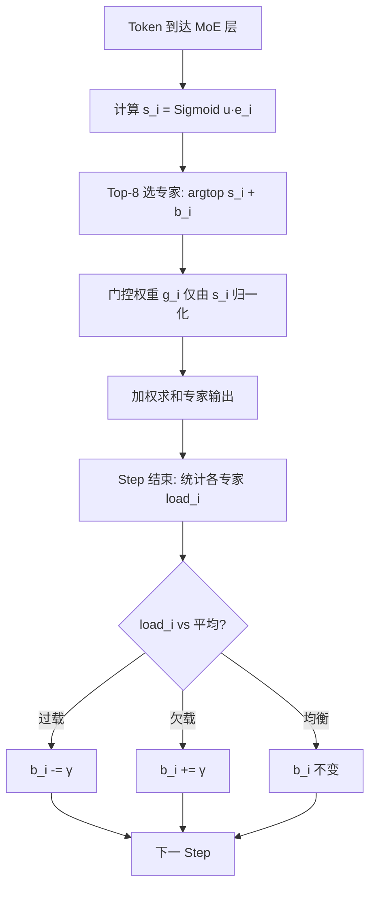
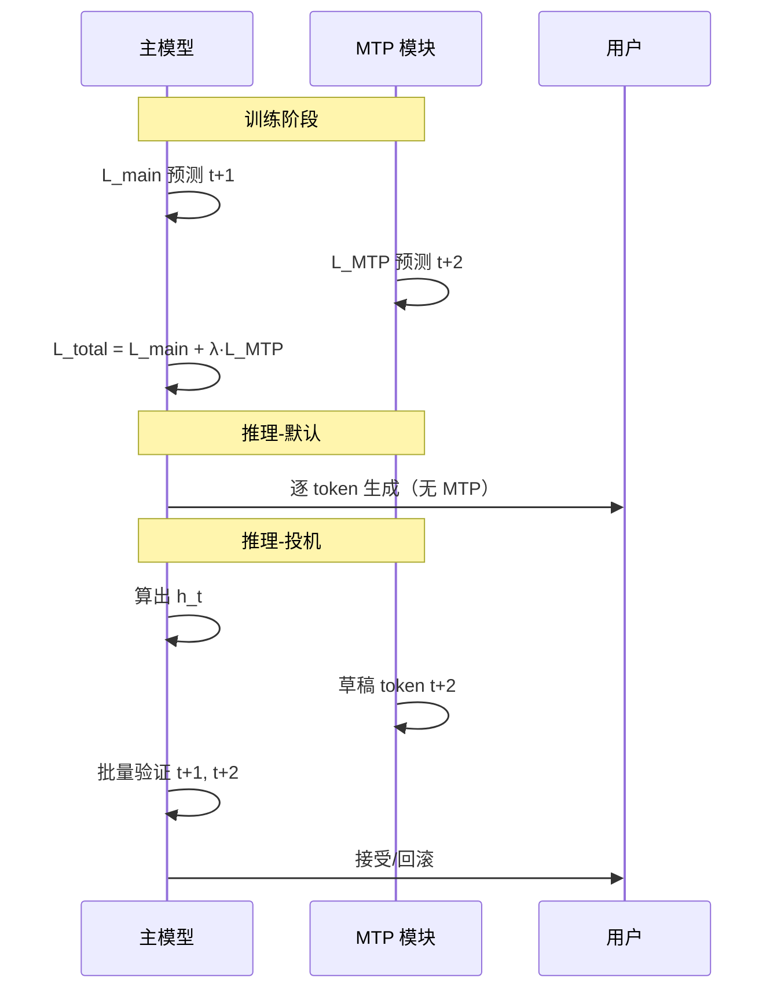
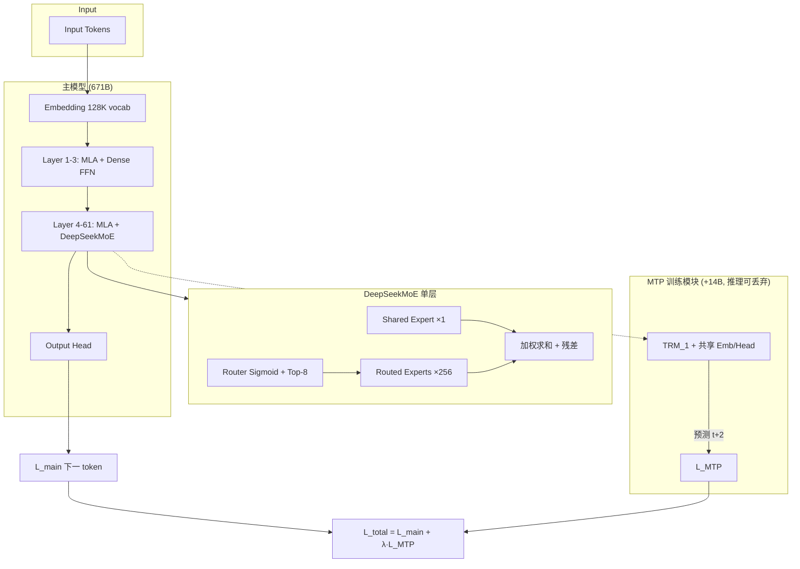

# DeepSeek-V3 架构与训练工程深度解读

> **面向读者**：零基础或刚入门 LLM 的工程师、产品、研究者  
> **主要依据**：[DeepSeek-V3 Technical Report (arXiv:2412.19437)](https://arxiv.org/abs/2412.19437)、[DeepSeek-V2 论文 (arXiv:2405.04434)](https://arxiv.org/abs/2405.04434)  
> **生成日期**：2026-06-08

---

## 阅读导航

| 章节 | 内容 |
|------|------|
| [0. 30 秒速览](#0-30-秒速览) | 一句话 + 核心数字 |
| [1. Transformer 基础 → MLA](#1-transformer-基础--mla-为何-kv-cache-是瓶颈) | 注意力机制、KV Cache、MLA 压缩 |
| [2. MoE 与 DeepSeekMoE](#2-moe-原理与-deepseekmoe) | Router、Top-K、Shared/Routed Experts、671B/37B |
| [3. 无辅助损失负载均衡](#3-auxiliary-loss-free-load-balancing) | bias 动态调节逐步解释 |
| [4. Multi-Token Prediction](#4-multi-token-prediction-mtp) | 训练目标、推理丢弃、投机解码 |
| [5. FP8 混合精度训练](#5-fp8-混合精度训练) | 格式、难点、DeepSeek 验证路径 |
| [6. 训练并行与集群拓扑](#6-训练并行与-2048-h800-集群拓扑) | PP/EP/DP/DualPipe/IB/NVLink |
| [7. 架构对比表](#7-与-gpt-4llama-3qwen-架构对比) | 四家横向对比 |
| [8. Trade-off FAQ](#8-架构选择的-trade-off-faq) | 至少 6 条常见权衡问答 |

---

## 0. 30 秒速览

**DeepSeek-V3** 是一个 **MoE（混合专家）** 大语言模型：

- **总参数量 671B**（6710 亿）：所有专家权重加在一起的大小  
- **每 token 激活 37B**（370 亿）：实际参与一次前向计算的参数量  
- **核心架构**：Transformer + **MLA**（压缩 KV Cache）+ **DeepSeekMoE**（稀疏 FFN）+ **MTP**（多 token 训练目标）  
- **训练**：2048 张 H800、14.8T token、**FP8** 混合精度、约 278.8 万 GPU 小时  
- **上下文**：128K（YaRN 扩展）

用一句话概括设计哲学：**用稀疏激活换更大容量，用 MLA 换推理显存，用工程重叠换训练吞吐，用无辅助损失换专家专业化。**

---

## 术语速查（读正文前可扫一眼）

| 术语 | 英文 | 一句话解释 |
|------|------|-----------|
| **Token** | — | 模型处理文字的最小单位（约 1 个英文词或 0.5～1 个汉字） |
| **Transformer** | — | 2017 年提出的序列模型骨架，核心是 Self-Attention |
| **Self-Attention / 自注意力** | — | 每个 token 根据与其他 token 的相关性加权聚合信息 |
| **FFN / MLP** | Feed-Forward Network | 注意力之后的两层全连接，参数量通常占模型大半 |
| **KV Cache** | Key-Value Cache | 推理时缓存历史 token 的 K/V，避免重复计算；长上下文时显存杀手 |
| **RoPE** | Rotary Positional Embedding | 旋转位置编码，让模型感知 token 顺序 |
| **MoE** | Mixture of Experts | 多个 FFN「专家」，Router 为每个 token 挑选少数几个 |
| **Router / Gating** | — | 决定 token 去哪些专家的网络 |
| **Top-K** | — | 只选得分最高的 K 个专家 |
| **PP / EP / DP / TP** | Pipeline / Expert / Data / Tensor Parallelism | 四种常见分布式切分方式（见第 6 章） |
| **FP8** | 8-bit Floating Point | 8 位浮点，训练/推理省显存、提算力，但精度更窄 |
| **Speculative Decoding** | 投机解码 | 用小模型/草稿头先猜多个 token，大模型批量验证，加速生成 |

---

## 1. Transformer 基础 → MLA：为何 KV Cache 是瓶颈

### 1.1 标准 Transformer 在做什么？

DeepSeek-V3 的骨架仍是 **Decoder-only Transformer**（与 GPT 系列相同）：

```
输入 token 序列
    ↓ Embedding（词嵌入）
    ↓ × N 层 Transformer Block
        ├── Multi-Head Attention（自注意力）
        └── FFN / MoE（前馈或混合专家）
    ↓ Output Head（预测下一个词的概率分布）
```

每一层的 **Self-Attention** 可以直觉理解为：当前词「回头看」整句里哪些词最重要，按重要性加权汇总。

### 1.2 多头注意力（MHA）与 KV Cache

**MHA（Multi-Head Attention，多头注意力）** 把隐藏向量拆成 `n_h` 个头，每个头独立做注意力，再拼回去。

对第 `t` 个 token，需要三组向量（每个头一份）：

- **Q（Query，查询）**：「我在找什么？」
- **K（Key，键）**：「我有什么可被匹配的索引？」
- **V（Value，值）**：「匹配上了拿什么内容？」

**训练**时，整句一起算，每个 token 能看到前面所有 token（因果掩码）。

**推理（逐 token 生成）** 时，每生成一个新 token，都要和所有历史 token 做注意力。历史 token 的 K、V **算过一遍就不变**，于是缓存起来——这就是 **KV Cache**。

#### 为何 KV Cache 成为瓶颈？

| 因素 | 说明 |
|------|------|
| **随序列长度线性增长** | 128K 上下文 = 缓存 12.8 万个 token 的 K/V |
| **随层数线性增长** | DeepSeek-V3 有 **61 层**，每层各存一份 |
| **随 batch 线性增长** | 同时服务 100 个用户 = 100 份 Cache |
| **占用 HBM（显存）** | 算力涨得快，显存带宽和容量常先触顶 |

**DeepSeek-V3 若用标准 MHA**（128 头 × 每头 128 维）：

```
每层每 token 的 KV Cache 元素数 = 2 × n_h × d_h
                                = 2 × 128 × 128
                                = 32,768 个浮点数
```

61 层 × 128K 上下文 × BF16（2 字节）：

```
32,768 × 61 × 131,072 × 2 ≈ 524 GB（仅 KV Cache，单条序列）
```

这还没算模型权重（671B 参数）和激活值——**长上下文推理几乎不可能**。

#### 业界常见缓解：GQA / MQA

| 方法 | 思路 | 每层每 token Cache 大小（V3 维度下） |
|------|------|--------------------------------------|
| **MHA** | 每头独立 K/V | 32,768 |
| **GQA**（Grouped Query Attention） | 多 Q 头共享少量 KV 头 | 2 × 8 × 128 = **2,048**（Llama 3 405B 用 8 个 KV 头） |
| **MQA**（Multi-Query Attention） | 所有头共享 1 组 K/V | 2 × 128 = **256** |

GQA 是 Llama、Qwen 等的主流选择，但 DeepSeek 走了更激进的路：**MLA**。

---

### 1.3 MLA（Multi-head Latent Attention）如何压缩？

**MLA** 首次在 **DeepSeek-V2** 提出并验证，V3 **原样继承** 其核心设计。

#### 核心思想：低秩联合压缩 K 和 V

不再为每个头单独缓存完整 K、V，而是：

1. 把隐藏状态 **投影到一个小的共享潜向量** `c_KV`（维度 `d_c`）
2. 需要时再 **上投影** 还原各头的 K、V
3. **RoPE 位置信息** 单独放在一个小向量 `k_R` 里（与内容潜向量解耦）

#### 公式直觉（对应 V3 论文式 1–11）

```
c_KV = W_DKV · h          # 下投影：d → d_c（压缩）
K_heads = W_UK · c_KV     # 上投影还原各头 Key 的内容部分
V_heads = W_UV · c_KV     # 上投影还原各头 Value
k_R = RoPE(W_KR · h)      # 单独携带旋转位置编码的 Key 切片

最终 K = [K_content ; k_R]  # 拼接
```

**推理时只需缓存（蓝色框）**：

- `c_KV`：维度 **512**
- `k_R`：维度 **64**（每头 RoPE 部分，`d_h^R = 64`）

```
MLA 每层每 token Cache = d_c + d_h^R = 512 + 64 = 576 个浮点数
```

#### 数字对比（DeepSeek-V3 配置）

| 配置项 | 数值 | 含义 |
|--------|------|------|
| 隐藏维度 `d` | **7168** | 每层主通道宽度 |
| 注意力头数 `n_h` | **128** | 并行注意力头 |
| 每头维度 `d_h` | **128** | 单头宽度 |
| KV 压缩维 `d_c` | **512** | 联合潜向量宽度（≪ 128×128） |
| Query 压缩维 `d_c'` | **1536** | 训练时减激活显存（推理可不缓存 Q） |
| RoPE Key 维 `d_h^R` | **64** | 位置编码专用切片 |

| 注意力变体 | 每层每 token Cache（元素数） | 相对 MHA |
|------------|------------------------------|----------|
| MHA | 32,768 | 1× |
| GQA（8 KV 头） | 2,048 | 0.063× |
| **MLA（V3）** | **576** | **0.018×（约 57 倍压缩）** |

**128K 上下文 + 61 层 + BF16 粗算**：

```
MLA：576 × 131,072 × 61 × 2 ≈ 9.2 GB（单序列 KV Cache）
MHA：524 GB（同上假设）
```

DeepSeek-V2 论文报告：相对其 GQA 前身 **KV Cache 减少约 93%**，长上下文吞吐提升 **约 5.76×**。

#### MLA 架构图（ASCII）

```
                    ┌─────────────────────────────────────┐
  隐藏状态 h_t ────►│ W_DKV 下投影                         │
                    └──────────────┬──────────────────────┘
                                   ▼
                         c_KV (512) ──────► 缓存区 ◄── 核心压缩
                          │    │
              W_UK        │    │        W_UV
                          ▼    ▼
                    K_content  V  （按需上投影，可不落盘）
                          │
              h_t ──► W_KR ──► RoPE ──► k_R (64) ──► 缓存区

  Query 侧（类似压缩，训练省激活）：
  h_t ──► W_DQ ──► c_Q (1536) ──► W_UQ / W_QR ──► Q
```

#### 推理优化：吸收上投影矩阵

V2 论文指出：`W_UK` 可吸收进 `W_Q`，`W_UV` 可吸收进输出投影 `W_O`，从而 **不必显式还原完整 K/V**，进一步省算力——这是 MLA 能落地到生产推理的关键工程细节。

---

## 2. MoE 原理与 DeepSeekMoE

### 2.1 为什么需要 MoE？

Dense 模型（如 Llama 3 405B）：**每个 token 激活全部 FFN 参数** → 容量大，但训练和推理都贵。

**MoE（Mixture of Experts，混合专家）**：把 FFN 拆成很多「专家」小网络，**每个 token 只激活 Top-K 个** → 总参数量可以极大，单次计算量可控。

```
Dense FFN:  token ──► 一个大 MLP（全部参数参与）
MoE FFN:    token ──► Router 选 K 个专家 ──► 加权求和 K 个小 MLP 输出
```

### 2.2 MoE 基本组件

| 组件 | 作用 |
|------|------|
| **Router（门控网络）** | 计算 token 与各专家的「亲和度」分数 |
| **Top-K 选择** | 只保留分数最高的 K 个专家 |
| **Expert FFN** | 每个专家是一个 SwiGLU 风格 MLP |
| **加权聚合** | 用门控值对 K 个专家输出加权求和 |

DeepSeek-V3 路由公式（论文式 12–15）：

```
s_i = Sigmoid(u^T · e_i)           # 亲和度，e_i 为专家 i 的质心向量
选 Top-K：g'_i = s_i 若 s_i+b_i 在 Top-K 内，否则 0   # b_i 见第 3 章
g_i = g'_i / Σ g'_j                # 归一化门控权重
输出 = u + Σ SharedExpert(u) + Σ g_i · RoutedExpert_i(u)
```

注意：V3 相对 V2 改用 **Sigmoid + Top-K 归一化**（V2 用 Softmax 类路由）。

### 2.3 DeepSeekMoE 的两项结构创新（来自 V2/V3）

#### （1）细粒度专家分割（Fine-Grained Expert Segmentation）

传统 MoE（如 GShard）：每层 **8 个专家**，每个很「胖」。

DeepSeekMoE：每层 **256 个 routed 专家**，每个更「瘦」，但 Top-8 激活 → **组合更灵活，专业化更细**。

#### （2）共享专家隔离（Shared Expert Isolation）

| 类型 | DeepSeek-V3 | 作用 |
|------|-------------|------|
| **Shared Expert（共享专家）** | **1 个**，每个 token **必过** | 捕获通用知识（语法、常见搭配） |
| **Routed Expert（路由专家）** | **256 个**，每 token **激活 8 个** | 捕获领域/模式专用知识 |

```
                    ┌── Shared Expert ──►  always on
token 表示 u_t ────┤
                    └── Router ──► Top-8 of 256 Routed Experts ──► 加权求和
```

V2 用 2 个共享 + 160 routed + Top-6；V3 规模更大：**1 shared + 256 routed + Top-8**。

### 2.4 671B / 37B 到底是什么意思？

这是 MoE 模型最重要的两个数字：

| 指标 | DeepSeek-V3 | 直觉 |
|------|-------------|------|
| **总参数量（671B）** | 磁盘/集群里 **所有专家权重之和** + Attention 等稠密部分 | 「图书馆藏书总量」 |
| **激活参数量（37B）** | 处理 **一个 token、一层 MoE** 时实际参与的参数 | 「你这次借出几本书」 |

**37B 的构成（粗算逻辑）**：

```
≈ 全部 Attention 参数（每层都跑，61 层 MLA）
+ 前 3 层 Dense FFN（V3 仅前 3 层不用 MoE）
+ 58 层 MoE：每 token 激活 (1 shared + 8 routed) × 每专家 FFN 参数量
```

**58 层 MoE**，每专家 intermediate 维度 **2048**，隐藏维 **7168** → 每个 routed/shared 专家 FFN 约 `3 × 7168 × 2048` 量级参数；256 专家 × 58 层贡献总参数大头，但单次只算 9 份（1+8）。

对比：

| 模型 | 总参数 | 每 token 激活 | 稀疏度 |
|------|--------|---------------|--------|
| Llama 3 405B | 405B | **405B**（Dense） | 1× |
| DeepSeek-V2 | 236B | 21B | ~11× |
| **DeepSeek-V3** | **671B** | **37B** | **~18×** |
| Qwen2.5 72B | 72B | 72B（Dense） | 1× |

**关键结论**：V3 用 **约 1/18 的算力** 驱动 **比 405B Dense 更大容量** 的模型；代价是 **All-to-All 通信**、**负载均衡**、**推理部署复杂**。

### 2.5 DeepSeek-V3 MoE 层结构图

```
┌──────────────────────────────────────────────────────────────┐
│                    Transformer Layer (×61)                    │
│  ┌─────────────┐    ┌─────────────────────────────────────┐ │
│  │ MLA Attention│───►│ FFN 部分                             │ │
│  └─────────────┘    │  Layer 1-3: Dense FFN               │ │
│                      │  Layer 4-61: DeepSeekMoE             │ │
│                      │    ├─ 1 × Shared Expert (always)    │ │
│                      │    └─ Router → Top-8 / 256 Experts  │ │
│                      └─────────────────────────────────────┘ │
└──────────────────────────────────────────────────────────────┘
```

**V3 完整架构参数一览**：

| 项目 | 值 |
|------|-----|
| Transformer 层数 | 61 |
| 隐藏维度 | 7168 |
| MoE 层数 | 58（第 4–61 层） |
| Dense FFN 层 | 3（第 1–3 层） |
| Routed 专家数 / 层 | 256 |
| Shared 专家数 / 层 | 1 |
| Top-K（routed） | 8 |
| 专家 FFN 中间维 | 2048 |
| 词表 | 128K BPE |

---

## 3. Auxiliary-Loss-Free Load Balancing

### 3.1 问题：负载不均衡会怎样？

MoE 训练把不同专家分布到不同 GPU（**Expert Parallelism，EP**）。若 Router 总把 token 送给少数几个「热门专家」：

| 现象 | 后果 |
|------|------|
| **Routing Collapse（路由坍塌）** | 大部分专家学不到东西，容量浪费 |
| **GPU 负载倾斜** | 部分 GPU 爆满、部分空闲 → **算力浪费** |
| **All-to-All 阻塞** | 等待最慢 GPU → 整体吞吐下降 |

### 3.2 传统方案：辅助损失（Auxiliary Loss）

Switch Transformer、GShard 等引入 **L_aux**，惩罚「某些专家过热/过冷」：

```
总损失 = 主任务损失（下一词预测）+ α · L_aux
```

**矛盾**：α 太大 → 模型被迫「平均分配」token，**损害专家专业化**；α 太小 → 负载仍不均衡。DeepSeek-V2 已观察到该 trade-off。

### 3.3 DeepSeek-V3 创新：无辅助损失，用 bias 动态调节

**核心思想**：负载均衡 **不进入梯度**，只 **微调路由决策边界**。

#### 逐步机制（对应论文式 16）

**Step 0 — 初始化**

- 每个 routed 专家 `i` 有一个可学习质心 `e_i`（Router 用）
- 额外有一个 **标量 bias** `b_i`（**不参与反向传播**，或说不乘到门控输出上）

**Step 1 — 前向路由（每个 token）**

```
1. 计算亲和度：s_i = Sigmoid(u^T · e_i)
2. 选专家：看 (s_i + b_i) 的 Top-8，不是看 s_i  alone
3. 门控权重：仍用原始 s_i 归一化 → g_i = s_i / Σ s_j（selected）
4. FFN 输出：Σ g_i · Expert_i(u)   ← bias 不影响权重幅度
```

**关键分离**：

| 量 | 用途 | 是否影响表示学习梯度 |
|----|------|---------------------|
| `s_i` | 门控权重、专家输出加权 | ✅ 是 |
| `b_i` | **仅** 决定 Top-K 入选名单 | ❌ 否（启发式调度） |

**Step 2 — 监控负载（每个训练 step 末）**

- 统计 batch 内每个专家实际处理的 token 数 `load_i`
- 与理想均衡负载 `load_avg` 比较

**Step 3 — 更新 bias（启发式，非梯度）**

```
若专家 i 过载（load_i > load_avg）：  b_i ← b_i - γ
若专家 i 欠载（load_i < load_avg）：  b_i ← b_i + γ
```

- **γ（bias update speed，偏置更新速度）**：V3 训练前 **14.3T token 用 0.001**，最后 **500B token 冻结为 0.0**（让路由稳定收敛）
- 过载专家 bias 降低 → `s_i + b_i` 更难进 Top-K → 流量被「挤」到其他专家

**Step 4 — 重复**

整个训练过程中 bias 像「交通信号灯」一样持续微调，**主 loss 全程不被 L_aux 污染**。

#### 流程图（mermaid）



### 3.4 补充：序列级辅助损失（很小）

V3 **并非完全零辅助损失**，还保留极弱的 **Sequence-Wise Balance Loss**（α = **0.0001**）：

- 作用域：**单条序列内** 防极端偏斜
- 量级：相对主 loss 可忽略
- 主负载均衡仍靠 bias 机制

### 3.5 消融实验结论（论文 Table 5）

同等规模 MoE 上，**Aux-Loss-Free 在多数 benchmark 优于纯 Aux-Loss**，且专家在 Pile 不同领域呈现 **更明显的专业化模式**（论文 Figure 9）。

---

## 4. Multi-Token Prediction (MTP)

### 4.1 标准训练 vs MTP

| | 标准 Next-Token Prediction | MTP |
|--|------------------------------|-----|
| 每位置监督信号 | 预测 **1** 个未来 token | 预测 **D+1** 个（含主预测） |
| 数据效率 | 每 token 1 次 CE loss | 更 **dense** 的训练信号 |
| V3 配置 | 主 head 预测 t+1 | **D=1**：额外预测 t+2 |

### 4.2 V3 的 MTP 模块结构（D=1）

V3 只加 **1 个 MTP 深度**（额外 14B 参数，HuggingFace 上总重 685B = 671B 主模型 + 14B MTP）。

每个 MTP 模块含：

- **共享 Embedding**（与主模型同一套）
- **共享 Output Head**（与主模型同一套）
- **1 个 Transformer Block** `TRM_k`
- **投影矩阵** `M_k ∈ R^{d×2d}`

前向（第 k 深度，k=1）：

```
输入 = M_k · concat( RMSNorm(h_main), RMSNorm(Emb(t_{i+k})) )
     ↓
TRM_k
     ↓
OutHead → 预测 token t_{i+k+1} 的概率
```

**与 Gloeckle et al. 2024 的区别**：V3 **顺序** 保持因果链（类似 EAGLE），而非 D 个头并行独立预测。

### 4.3 训练目标与主 loss 关系

每个深度 k 有交叉熵：

```
L_MTP^k = CrossEntropy(P_{2+k:T+1}^k, ground_truth)
```

总 MTP 损失：

```
L_MTP = (λ / D) · Σ_k L_MTP^k
```

**完整训练损失**：

```
L_total = L_main（下一 token）+ L_MTP
```

| 超参 | V3 设置 |
|------|---------|
| D | 1 |
| λ（前 10T token） | **0.3** |
| λ（后 4.8T token） | **0.1** |

**直觉**：MTP 迫使中间表示 **提前规划** 更远 token；λ 后期降低，避免过度干扰主目标。

论文 Table 4 消融：同等推理成本（推理丢弃 MTP）下，**加 MTP  consistently 提升** MMLU、HumanEval、GSM8K 等。

### 4.4 推理：丢弃 vs 投机解码

| 模式 | 做法 | 适用 |
|------|------|------|
| **默认推理** | **丢弃 MTP 模块**，主模型独立工作 | 生产部署、与 671B 主模型等价 |
| **Speculative Decoding** | 用 MTP 头 **草稿** 第 2 个 token，主模型 **并行验证** | 低延迟场景 |

投机解码数据（V3 论文）：

- 第 2 token **接受率 85%～90%**
- 解码吞吐 **约 1.8× TPS**（Tokens Per Second）



---

## 5. FP8 混合精度训练

### 5.1 什么是 FP8？

**FP8** = 8 位浮点数，用更少比特表示一个数。

NVIDIA H100/H800 的 Tensor Core 原生支持 FP8 GEMM（矩阵乘），**理论算力相对 BF16 约 2×**。

常见两种 FP8 格式：

| 格式 | 指数位 | 尾数位 | 特点 |
|------|--------|--------|------|
| **E4M3** | 4 | 3 | 精度稍高，动态范围较小 |
| **E5M2** | 5 | 2 | 动态范围大，精度更低 |

DeepSeek-V3 **全程 E4M3**（含前向和反向 GEMM），靠 **细粒度缩放** 弥补动态范围不足。

### 5.2 为什么 FP8 训练难？

| 难点 | 说明 |
|------|------|
| **动态范围窄** | 激活/权重存在 outlier（极大值），粗粒度缩放易溢出/下溢 |
| **累加精度不足** | H800 Tensor Core FP8 GEMM 累加仅 ~**14 bit**，大 K 维时误差可达 ~2% |
| **MoE 放大量级** | 路由、All-to-All 使误差传播路径更复杂 |
| **缺乏大规模验证** | V3 之前少有 **600B+ 级** FP8 预训练成功案例 |

### 5.3 DeepSeek-V3 的 FP8 框架（如何验证可行）

#### 混合精度策略（图 6）

| 用 FP8 | 保持 BF16/FP32 |
|--------|----------------|
| 线性层 GEMM（Fprop / Dgrad / Wgrad） | Embedding、Output Head |
| MoE 专家矩阵乘 | **Attention 全套**（MLA） |
| 部分激活缓存 | LayerNorm / RMSNorm、**MoE Router** |

**Master 权重、优化器状态**：权重梯度 FP32；Adam 一阶/二阶矩 **BF16**（省显存且稳定）。

#### 三大精度技巧

**（1）细粒度量化（Fine-Grained Quantization）**

| 张量 | 分组缩放 |
|------|----------|
| 激活 | **1×128**（每 token 每 128 通道一组 scale） |
| 权重 | **128×128** block 一组 scale |

比「整 tensor 一个 scale」更能适应 outlier。

**（2）提升累加精度（Promotion to CUDA Cores）**

- 每 **N_C = 128** 次 MMA 后，把部分和 **搬到 CUDA Core 用 FP32 累加**
- 同时做 per-group **反量化**
- 相对纯 Tensor Core 14-bit 累加，**相对 loss 误差 < 0.25%**

**（3）在线量化（Online Quantization）**

- 每个 1×128 tile **当场** 算 max → scale → 转 FP8
- 不用跨 step 历史 max，避免 scale 漂移

#### 低精度存储与通信

- MoE **dispatch 前** 激活量化 FP8 → **省带宽**
- SwiGLU 输入 FP8 缓存 + 反向 **重算** → 省显存
- Attention 后 Linear 输入用定制 **E5M6** 格式

#### 验证路径（论文 Appendix B.1）

在 **DeepSeek-V2-Lite / V2 规模** 上先训练 ~**1T token** FP8 vs BF16 对照 → loss 曲线几乎重合 → 再推到 **671B / 14.8T** 全量预训练。

**结果**：全程 **零不可恢复 loss spike**，无需 rollback——FP8 在大规模 MoE 上 **工程可行**。

```
┌─────────────────────────────────────────────────────────┐
│                  FP8 混合精度数据流                       │
│  BF16 激活 ──► 1×128 量化 ──► FP8 GEMM ──► BF16 输出   │
│                    ↑                      ↓              │
│              在线 scale              每 128 元 FP32 累加  │
│  Attention / Norm / Router：全程 BF16（稳定锚点）         │
└─────────────────────────────────────────────────────────┘
```

---

## 6. 训练并行与 2048 H800 集群拓扑

### 6.1 四种并行一览

| 缩写 | 全称 | 切什么 | DeepSeek-V3 用法 |
|------|------|--------|------------------|
| **DP** | Data Parallelism | 数据 batch | **ZeRO-1**（优化器分片） |
| **TP** | Tensor Parallelism | 单层矩阵切多卡 | 训练 **不用 TP**（省通信） |
| **PP** | Pipeline Parallelism | 层切到不同 GPU | **16-way PP** |
| **EP** | Expert Parallelism | 专家切到不同 GPU | **64-way EP**（跨 8 节点） |

**为何训练不用 TP？** 通过 **重计算（RMSNorm、MLA 上投影）**、**FP8**、**DualPipe** 把单卡显存压够，避免 TP 的频繁 All-Reduce。

### 6.2 2048 H800 集群物理拓扑

```
集群总量：2048 GPU = 256 节点 × 8 GPU/节点

单节点内部：
  GPU0 ── NVLink ── GPU1 ── ... ── GPU7
           ↑ NVSwitch 全互联，带宽 ~160 GB/s

节点之间：
  每 GPU 对应槽位 ── InfiniBand (IB) ── 远端同槽位 GPU
  IB 带宽 ~50 GB/s（约为 NVLink 1/3.2）
```

**Node-Limited Routing（节点受限路由，M=4）**：

- 每个 token 最多发往 **4 个节点** 上的专家
- 先经 **IB** 跨节点，再经 **NVLink** 节点内转发
- 设计目标：**IB 与 NVLink 通信重叠**，控制 cross-node 流量

### 6.3 并行映射（训练时）

```
2048 GPU 逻辑切分：

PP = 16  →  每条 pipeline 128 GPU（2048/16）
EP = 64  →  每层 256 专家均匀放在 64 GPU（每 GPU ~4 专家）
             64 GPU = 8 节点 × 8 GPU（每节点 8 卡专责 EP）

DP（ZeRO-1）→  在 PP×EP 之外切 batch 维度

每层 MoE：256 routed experts ÷ 64 GPU ≈ 每 GPU 4 个专家
Node limit M=4：单 token 的 8 个专家最多 spread 在 4 个节点 → 控制 IB 跳数
```

### 6.4 DualPipe：流水线 + 通信重叠

**问题**：跨节点 EP 的 **All-to-All** 很重，计算:通信 ≈ **1:1**，传统 PP 大量空泡。

**DualPipe 思路**：

1. **双向流水线**：micro-batch 从 pipeline **两端同时** 注入
2. 每个 chunk 拆四段：`Attention → A2A dispatch → MLP/MoE → A2A combine`
3. **Forward 的通信** 与 **Backward 的计算** 重叠（类似 ZeroBubble）
4. 定制 **20 SM** 做 All-to-All kernel（共 132 SM），与计算流并行

**效果**：All-to-All 与 PP 通信 **几乎完全被隐藏**；规模再大，只要计算/通信比恒定，仍可 **近零 A2A 开销**。

```
时间轴 →
GPU rank 0:  [FWD attn][A2A][MoE][A2A][BWD...]     ← 与对向 rank 通信重叠
GPU rank 8:       [A2A][MoE][A2A][FWD attn]...
                 ↑ DualPipe 双向填充 pipeline bubble
```

### 6.5 训练效率数字

| 指标 | 数值 |
|------|------|
| 集群 | 2048 × H800 |
| 每 T token GPU 小时 | **180K** |
| 14.8T 预训练 | **266.4 万** GPU 小时（~2 个月） |
| 上下文扩展 | 11.9 万 GPU 小时 |
| 后训练 SFT+RL | 0.5 万 GPU 小时 |
| **合计** | **278.8 万 GPU 小时（约 $5.58M @ $2/GPU·h）** |

---

## 7. 与 GPT-4、Llama 3、Qwen 架构对比

> **说明**：GPT-4 架构 **未公开**；下表 GPT-4 列来自公开报告与行业推断，标注「未披露」处请谨慎引用。

| 维度 | **DeepSeek-V3** | **GPT-4 / GPT-4o** | **Llama 3.1 405B** | **Qwen2.5 72B** |
|------|-----------------|---------------------|---------------------|-----------------|
| **架构类型** | Sparse MoE | 未披露（推测 Dense 或 MoE 变体） | **Dense** | **Dense** |
| **总参数** | **671B** | 未披露（传 ~1.8T MoE 等，无官方） | **405B** | **72B** |
| **激活参数/token** | **37B** | 未披露 | **405B** | **72B** |
| **层数** | 61 | 未披露 | **126** | **80** |
| **隐藏维度** | **7168** | 未披露 | **16384** | **8192** |
| **注意力** | **MLA**（KV 压缩 512+64） | 未披露 | **GQA**（128 Q / **8 KV**） | **GQA**（64 Q / **8 KV**） |
| **FFN** | MoE：1 shared + 256 routed, Top-8 | 未披露 | Dense SwiGLU | Dense SwiGLU |
| **KV Cache 策略** | 潜向量 576 维/层/token | 未披露 | 8 KV 头 GQA | 8 KV 头 GQA |
| **位置编码** | RoPE（YaRN 扩 128K） | 未披露 | RoPE θ=500k | RoPE |
| **训练精度** | **FP8 混合** | 未披露 | BF16（公开信息） | BF16 |
| **训练 token** | **14.8T** | 未披露 | **~15T+** | **~18T** |
| **上下文长度** | **128K** | 128K 级（产品） | **128K** | **128K** |
| **负载均衡** | **Aux-Loss-Free bias** | 未披露 | N/A（Dense） | MoE 版用 aux loss |
| **多 token 训练** | **MTP（D=1）** | 未披露 | 无 | 无 |
| **开源权重** | ✅ | ❌ | ✅ | ✅ |

### 设计哲学对比（一句话）

| 模型 | 哲学 |
|------|------|
| **DeepSeek-V3** | 稀疏大容量 + MLA 省推理 + 极致训练工程 |
| **Llama 3 405B** | 纯 Dense 堆规模，GQA 平衡推理，架构保守求稳 |
| **Qwen2.5 72B** | 中等 Dense + 多语言数据 + 长上下文产品化 |
| **GPT-4** | 闭源全栈优化，架构不公开，靠规模与 RLHF/RL 对齐 |

---

## 8. 架构选择的 Trade-off FAQ

### Q1：为什么用 MoE 而不是像 Llama 405B 那样做 Dense？

**答**：Dense 405B **每个 token 都要算 405B 参数**，训练 FLOPs 与推理延迟随参数量线性涨。MoE 把 **容量（671B）** 与 **算力（37B）** 解耦，在相近单次延迟下提供更大「知识库」。代价是 **All-to-All 通信、负载均衡、部署冗余专家** 等系统复杂度——DeepSeek 用 DualPipe + Aux-Loss-Free + FP8 换这套复杂度可控。

### Q2：MLA 比 GQA 强在哪？为什么不所有人都用？

**答**：MLA 把 KV Cache 压到 **~576 维/层**，比 GQA（8 KV 头 ≈2048 维）还省 **约 4×**，128K 长上下文更友好。代价是 **实现复杂**（解耦 RoPE、矩阵吸收、定制 CUDA kernel），且与 **标准 FlashAttention 生态** 兼容需适配。GQA 更简单、社区支持成熟——大多数厂商优先 GQA。

### Q3：Aux-Loss-Free 会不会让负载均衡不稳定？

**答**：纯 bias 机制在 **batch 级** 做均衡；V3 仍加 **α=0.0001** 的序列级辅助 loss 防单序列极端偏斜。推理阶段用 **冗余专家部署**（prefill 32 冗余、decode 64 冗余）应对 domain shift。论文报告 **全程无 token dropping**。

### Q4：MTP 训练、推理丢弃，不是浪费 14B 参数吗？

**答**：MTP 是 **训练正则 + 表示学习增强**（类似辅助任务），推理丢弃后主模型 **零额外延迟**。若启用投机解码，MTP 模块 **变废为宝** 换 1.8× 吞吐。14B 是一次性训练成本，不是永久推理税。

### Q5：FP8 训练会不会损精度？为什么 Attention 不用 FP8？

**答**：Attention 对量化 **极敏感**（softmax 放大误差），且占训练时间比例相对 GEMM 较小。V3 把 FP8 集中在 **最吃算力的 Linear GEMM**，Attention/Router/Norm 锚定 BF16。消融显示 FP8 vs BF16 **loss 误差 < 0.25%**，全链路 **无 loss spike**。

### Q6：为什么训练不用 Tensor Parallelism？

**答**：TP 每层至少 **两次 All-Reduce**，在 2048 卡规模上通信主导。V3 选择 **16 PP + 64 EP + 重计算 + FP8 省激活**，单卡能装下 micro-batch。推理阶段 prefill/decode **仍用 TP4**（延迟敏感场景另一套优化）。

### Q7：671B 模型推理是不是一定要 hundreds of GPUs？

**答**：**权重** 671B × 2B（FP16）≈ **1.34TB**，需多卡存权重；但 **激活** 只按 37B 规模流动，**KV Cache** 因 MLA 远小于同规模 Dense。DeepSeek 披露：prefill 最少 **4 节点 32 GPU**，decode **40 节点 320 GPU**（含冗余专家），远低于「按 671B Dense 想象」的卡片数。

### Q8：Node-Limited Routing（M=4）会损害模型质量吗？

**答**：限制每个 token 最多跨 **4 个节点** 选专家，会略微 constrain 全局最优路由，但 **大幅降低 IB 流量** 并使通信可重叠。论文指出在此约束下仍可选 **平均 3.2 专家/节点 × 4 节点 ≈ 13 专家** 的等效规模，而实际 Top-8，**质量影响可控**，效率收益更大。

---

## 附录 A：DeepSeek-V3 完整架构总览（mermaid）



---

## 附录 B：关键论文引用

| 文献 | arXiv | 与本文关系 |
|------|-------|-----------|
| DeepSeek-V3 Technical Report | [2412.19437](https://arxiv.org/abs/2412.19437) | MTP、FP8、DualPipe、Aux-Loss-Free、超参 |
| DeepSeek-V2 | [2405.04434](https://arxiv.org/abs/2405.04434) | **MLA**、**DeepSeekMoE** 原始设计与维度 |
| DeepSeekMoE | Dai et al. 2024 | 细粒度专家、共享专家 |
| Aux-Loss-Free Balancing | Wang et al. 2024a | bias 机制理论来源 |

---

## 附录 C：DeepSeek-V2 → V3 架构演进

| 项目 | DeepSeek-V2 | DeepSeek-V3 |
|------|-------------|-------------|
| 层数 / 隐藏维 | 60 / 5120 | **61 / 7168** |
| Shared / Routed | 2 / 160, Top-6 | **1 / 256, Top-8** |
| 专家 intermediate | 1536 | **2048** |
| 总 / 激活参数 | 236B / 21B | **671B / 37B** |
| 负载均衡 | 辅助损失为主 | **Aux-Loss-Free + 弱 seq loss** |
| 训练目标 | 下一 token | **下一 token + MTP** |
| 训练精度 | BF16 | **FP8 混合** |
| 训练 token | 8.1T | **14.8T** |

V3 不是推翻 V2，而是在 **已验证的 MLA + DeepSeekMoE 骨架上** 做规模、均衡、精度、目标四重升级。

---

*文档版本：v1.0 | 如有官方后续修订，以 DeepSeek-AI GitHub 与 arXiv 为准*
