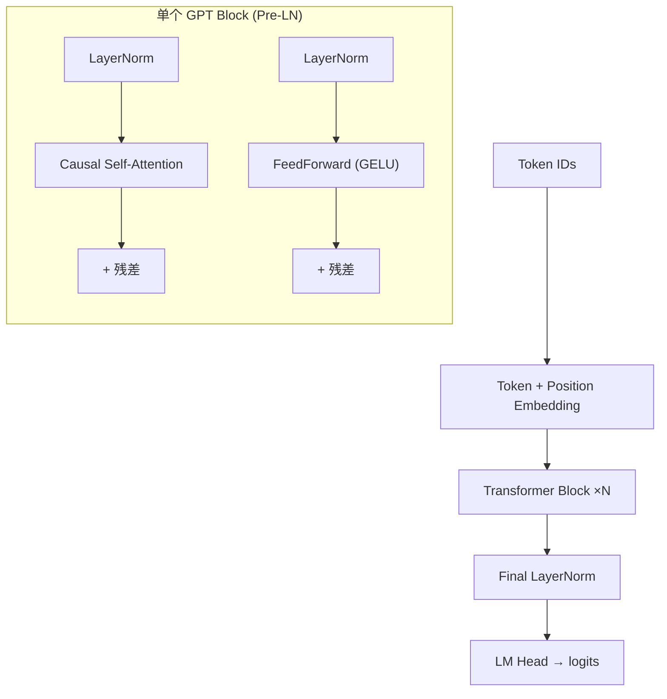

# 迷你 GPT 架构（Attention + FFN）

> **前置知识**：[Part 5 Transformer](/part-05-nlp/04-transformer)、[08-01 分词器](/part-08-llm-build/01-tokenizer-bpe)  
> **预计时间**：120 分钟  
> **本章产出**：读懂并用 PyTorch 实现因果 GPT Block

## GPT 是什么

GPT（Generative Pre-trained Transformer）是 **仅解码器** 的 Transformer 堆叠：

- Token + 位置嵌入
- N 层 Block：LayerNorm → 因果自注意力 → 残差 → LayerNorm → FFN → 残差
- 语言模型头：hidden → logits（与嵌入权重可绑定 tying）

## 本章图示

## 因果掩码

训练时每个位置只能看见左侧 token，保证生成时自回归一致。实现上对 attention score 施加下三角 mask。

## 代码地图

[`examples/part-08-llm-build/mini_gpt/model.py`](/examples/part-08-llm-build/mini_gpt/model.py) 包含：

| 模块 | 作用 |
|------|------|
| `CausalSelfAttention` | 多头因果注意力 |
| `FeedForward` | 两层 MLP + GELU |
| `TransformerBlock` | Pre-LN 残差块 |
| `MiniGPT` | 完整语言模型 |

配置默认极小（`d_model=128`, `n_layers=2`），方便 CPU 实验。

## 动手练习

1. 阅读 `CausalSelfAttention.forward`，画出 Q/K/V 形状变化
2. 将 `n_layers` 改为 4，估算参数量变化
3. 对照 [Part 5 Attention 一章](/part-05-nlp/03-attention) 复述 scaled dot-product 公式

## 示例文件

- [`mini_gpt/model.py`](/examples/part-08-llm-build/mini_gpt/model.py)
- [`mini_gpt/README.md`](/examples/part-08-llm-build/mini_gpt/README.md)

下一章：[08-03 预训练 Next Token Prediction](/part-08-llm-build/03-pretrain-ntp)
