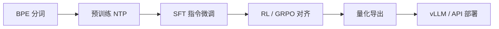

# 从迷你模型到开源大模型（DeepSeek / HF）

> **前置知识**：Part 8 前七章、[Part 6 部署](/part-06-practice/00-deployment)  
> **预计时间**：45 分钟  
> **本章产出**：把本地迷你流水线映射到工业级工具链

## 你已经走过的路

```text
BPE 训练 → GPT 架构 → NTP 预训练 → JSONL 数据 → SFT → 评估
```

开源 7B～671B 模型是 **同一流水线**，差异在规模、算力与对齐技术。

## 本章图示




## 推荐衔接

| 步骤 | 迷你教程 | 开源生态 |
|------|----------|----------|
| 分词 | `train_tokenizer.py` | HF `AutoTokenizer` |
| 训练 | `mini_gpt/train.py` | Megatron-DeepSpeed / HF Trainer |
| 微调 | `sft/train_sft.py` | LLaMA-Factory、Unsloth |
| 推理 | `generate.py` | vLLM、Ollama、DeepSeek API |
| 权重 | `checkpoints/*.pt` | HuggingFace `deepseek-ai` |

## DeepSeek 学习路径

1. 用 API 理解能力上限 → [Part 6](/part-06-practice/00-deployment)
2. 读原理 → [Part 7](/part-07-theory/training-guide)
3. 本地 LoRA → [guide-02](/part-06-practice/02-finetuning)
4. 理解 MoE / MLA → [V3 架构](/part-07-theory/v3-architecture)

## 下一步

- 继续 Part 8：[09 分布式训练](/part-08-llm-build/09-distributed-training)、[10 量化导出](/part-08-llm-build/10-quantization-export)
- 或进入 [Part 9 Agent 开发](/part-09-agents/01-agent-overview)

## 动手练习

1. 在 HuggingFace 找 `deepseek-ai/DeepSeek-R1-Distill-Qwen-1.5B`，对比 config 里的 `hidden_size`、`num_hidden_layers`
2. 列出从迷你 GPT 到 7B 模型，参数量大约放大多少倍
3. 规划：你更想深入「训练」还是「Agent 应用」？对应 Part 7 或 Part 9

## 示例文件

- [Part 8 示例总览](/examples/part-08-llm-build/README.md)
- [学习路线图 L7](/roadmap)

---

上一章：[08-07 评估与困惑度](/part-08-llm-build/07-eval-perplexity) · 下一章：[08-09 分布式训练](/part-08-llm-build/09-distributed-training)
