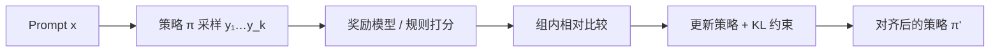

# GRPO / RL 直觉（衔接 Part 7）

<LearningMeta
  prereq="<a href='/part-07-theory/grpo-rl'>Part 7 GRPO</a>、<a href='/part-08-llm-build/05-sft-alpaca'>Part 8 SFT</a>"
  time="60 分钟"
  output="能口述 SFT → RL（GRPO）动机与奖励模型角色"
/>

SFT 教会模型「像助手一样说话」；**强化学习（RL）** 进一步对齐人类偏好（有用、无害、诚实）。

## 本章图示



## 为什么 SFT 不够

- SFT 只模仿示范数据，**不显式优化「哪个回答更好」**
- 数学、代码等可验证任务可用 **规则奖励**
- 开放式对话需要 **偏好模型 / 人工反馈**

## GRPO 在算什么

**GRPO（Group Relative Policy Optimization）** 可直觉为：

```text
1. 对同一 prompt 采样一组回答 {y1, y2, ..., yk}
2. 用奖励模型或规则给每条打分
3. 组内相对比较：好于平均的 ↑ 概率，差于平均的 ↓
4. 更新策略，并加 KL 约束别离 SFT 太远
```

与 PPO 相比，GRPO 省去独立 critic，实现更轻 — DeepSeek-R1 流水线采用类似思路（详见 [Part 7 R1](/part-07-theory/r1-pipeline)）。

## 奖励从哪来

| 类型 | 例子 | 适用 |
|------|------|------|
| 规则 | 单元测试通过、JSON 可解析 | 代码 Agent |
| RM | 训练偏好分类器 | 对话质量 |
| 人工 | 标注 A/B | 冷启动 |

::: info 学习路径
先跑通 SFT（[Part 8-05](/part-08-llm-build/05-sft-alpaca)），再读 [Part 7 GRPO 原文解读](/part-07-theory/grpo-rl)，最后看 [Part 6 RL 路线图](/part-06-practice/04-rl-roadmap)。
:::

## 动手练习

1. 设计一道数学题的三条回答，手写组内相对分数
2. 说明 KL 惩罚过大/过小各会怎样
3. 对比 [蒸馏](/part-10-advanced/03-distillation-practice)：RL 对齐 vs 蒸馏压缩

---

下一章：[10-02 MoE 与 DeepSeek 架构](/part-10-advanced/02-moe-deepseek-arch)
