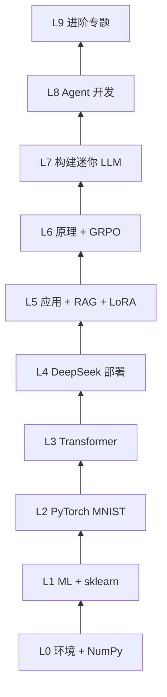

# 学习路线图

<LearningMeta
  time="阅读 15 分钟"
  output="选择适合自己的 Part 顺序与 L0～L9 目标"
/>

> 本文把 **基础课程（Part 0～5）**、**DeepSeek 实战（Part 6）**、**原理深读（Part 7）**、**构建 LLM（Part 8）**、**Agent（Part 9）** 与 **进阶专题（Part 10）** 串成一条可执行路径。

## 本章图示


---

## 能力阶梯 L0～L9

```text
L0  Python 环境 + NumPy 能跑通
L1  理解 ML 基础 + sklearn 小项目
L2  PyTorch 训练 MNIST
L3  理解 Transformer + 分词/Embedding
L4  DeepSeek API / 本地部署（Part 6 guide-00）
L5  应用开发 + RAG + LoRA 微调（Part 6 guide-01～03）
L6  原理深读 + GRPO / R1 流水线（Part 7）
L7  能构建迷你 LLM（Part 8：BPE → GPT → 预训练 → SFT → 量化）
L8  能开发 Agent（Part 9：工具 → RAG → 知识库项目 → 评测）
L9  进阶专题（Part 10：MoE、蒸馏、vLLM、多模态）
```



**8 周入门目标**：达到 **L5**；L6～L9 按兴趣延伸（造模型 / 做 Agent / 进阶架构）。

<HomeRoadmap />

---

## 完整学习顺序

### 阶段一：基础（第 1～4 周）

| 周 | Part | 里程碑 |
|----|------|--------|
| 1 | Part 0 + Part 1 前半 | 创建 venv，跑通 NumPy 脚本 |
| 2 | Part 1 后半 + Part 2 | 手算梯度直觉，理解损失函数 |
| 3 | Part 3 | Iris 线性回归 + 逻辑回归 |
| 4 | Part 4 | **MNIST 训练跑通**（Part 4 里程碑） |

### 阶段二：NLP 衔接 LLM（第 5 周）

| 天 | 任务 |
|----|------|
| 1～2 | Part 5：分词、Embedding、Attention |
| 3～4 | Part 5：Transformer 结构、预训练概念 |
| 5～7 | 复习 Part 2 矩阵运算 + Part 4 训练循环 |

> **读完 Part 5 再开始 DeepSeek 部署**——你会更容易理解 token、上下文与推理过程。

### 阶段三：DeepSeek 实战（第 6～8 周）

| 周 | 文档 | 产出 |
|----|------|------|
| 6 | [00 部署](/part-06-practice/00-deployment) + [01 应用](/part-06-practice/01-inference) | smoke test + `chat()` 封装 |
| 7 | [02 微调](/part-06-practice/02-finetuning) + [03 数据](/part-06-practice/03-data-evaluation) | 第一个 LoRA + Golden Set |
| 8 | [04 RL](/part-06-practice/04-rl-roadmap)（选修）+ [05 路线图](/part-06-practice/05-roadmap) | 复盘与进阶规划 |

### 阶段四：原理深读（穿插）

| 时机 | 文档 |
|------|------|
| 完成 Part 6 第 1 周后 | [训练全流程](/part-07-theory/training-guide) |
| 做部署优化时 | [V3 架构](/part-07-theory/v3-architecture) |
| 做 RL 实验前 | [GRPO](/part-07-theory/grpo-rl)、[R1 流水线](/part-07-theory/r1-pipeline) |
| 复现 Distill 时 | [蒸馏与复现](/part-07-theory/distill-reproduction) |

### 阶段五：构建 LLM（第 9～10 周，选修）

| 周 | Part 8 | 产出 |
|----|--------|------|
| 9 | [01～04](/part-08-llm-build/01-tokenizer-bpe) | BPE 分词器 + 迷你 GPT 预训练 |
| 10 | [05～10](/part-08-llm-build/05-sft-alpaca) | SFT + 评估 + 分布式/量化概念 |

### 阶段六：Agent 开发（第 11～12 周，选修）

| 周 | Part 9 | 产出 |
|----|--------|------|
| 11 | [01～04](/part-09-agents/01-agent-overview) | ReAct + Function Calling Agent |
| 12 | [05～10](/part-09-agents/05-rag-agent) | RAG / 知识库项目 / 评测与安全 |

### 阶段七：进阶专题（第 13 周+，选修）

| 主题 | Part 10 | 产出 |
|------|---------|------|
| 对齐与架构 | [01 GRPO](/part-10-advanced/01-grpo-rl-intuition)、[02 MoE](/part-10-advanced/02-moe-deepseek-arch) | 读懂 DeepSeek 技术报告 |
| 压缩与部署 | [03 蒸馏](/part-10-advanced/03-distillation-practice)、[04 vLLM](/part-10-advanced/04-vllm-deployment) | 跑通 distill demo |
| 多模态 | [05 Vision+LLM](/part-10-advanced/05-multimodal-intro) | 多模态 Agent 概念图 |

---

## 两条路径速查

```text
系统学习（推荐）：
  Part 0 → 1 → 2 → 3 → 4 → 5 → Part 6 → Part 7 → Part 8 → Part 9 → Part 10

已有 Python/ML 基础：
  Part 4（复习）→ Part 5 → Part 6 → Part 8 或 Part 9

想「造模型」：
  Part 5 → Part 8（可与 Part 6 微调章节交叉）

想「做 Agent」：
  Part 6 guide-01 → Part 9

只想快速用 DeepSeek：
  Part 0 §1 → Part 6 guide-00 → guide-01
  （建议仍补 Part 5 的 Transformer 一章）
```

---

## 自检清单

- [ ] Part 0：能创建 venv 并 `pip install numpy`
- [ ] Part 3：能在 Iris 上训练逻辑回归并解读准确率
- [ ] Part 4：MNIST 验证准确率 > 95%
- [ ] Part 5：能解释 Self-Attention 在算什么
- [ ] Part 6：`smoke_test.py` 返回 OK
- [ ] Part 6：完成一个最小 RAG 或 LoRA 实验
- [ ] Part 8（L7）：`train_tokenizer.py` + `mini_gpt/train.py` 跑通
- [ ] Part 9（L8）：知识库 Agent 或 RAG 示例跑通
- [ ] Part 10（L9）：蒸馏 demo 或 eval 脚本跑通

---

## 示例代码与数据

- 可下载示例：仓库 `examples/`（构建时复制到 `docs/public/examples/`）
- 数据集：`data/`（corpus、sft JSONL、sample_docs、agent_tools 等，见 [`data/README.md`](/data/README.md)）
- Python 依赖：[`examples/requirements.txt`](/examples/requirements.txt)
