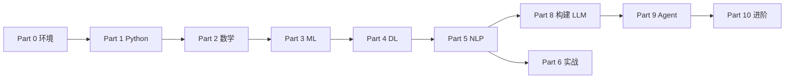

# 学习地图

<LearningMeta
  time="浏览 10 分钟"
  output="通过图示快速定位各 Part 章节"
/>

本站已启用 **Mermaid 流程图**、**KaTeX 公式** 与 **SVG 插图**。本页汇总关键可视化，点击链接跳转到对应章节。

## 总览路径

[查看完整路线图 →](/roadmap)

---

## 图示索引

| 图示 | 说明 | 相关章节 |
|------|------|----------|
|  | Part 0→10 总览 | [路线图](/roadmap) |
|  | 输入/隐藏/输出层 | [向量与矩阵](/part-02-math/01-vectors-matrices) |
|  | 前向/反向/优化 | [训练循环](/part-04-dl/05-training-loop) |
|  | Q/K/V 计算 | [注意力](/part-05-nlp/03-attention) |
|  | Encoder Block | [Transformer](/part-05-nlp/04-transformer) |
|  | 字节对合并 | [BPE 分词器](/part-08-llm-build/01-tokenizer-bpe) |
|  | 预训练→部署 | [衔接开源](/part-08-llm-build/08-scale-to-opensource) |
|  | 感知-规划-行动 | [Agent 概述](/part-09-agents/01-agent-overview) |

---

## 按主题浏览

### 数学与损失

- [向量点积与矩阵乘](/part-02-math/01-vectors-matrices) — 含公式 $u \cdot v$
- [贝叶斯公式](/part-02-math/03-probability)
- [MSE 与交叉熵](/part-02-math/05-loss-functions)

### 深度学习

- [自动求导计算图](/part-04-dl/02-autograd)
- [CNN 卷积直觉](/part-04-dl/04-cnn)
- [训练循环](/part-04-dl/05-training-loop)

### 大模型与 Agent

- [迷你 GPT 架构](/part-08-llm-build/02-mini-gpt-arch)
- [Next Token 预训练](/part-08-llm-build/03-pretrain-ntp)
- [ReAct 工具调用](/part-09-agents/02-react-tools)
- [知识库 Agent 项目](/part-09-agents/10-knowledge-agent-project)
- [GRPO / RL 直觉](/part-10-advanced/01-grpo-rl-intuition)

---

::: tip 贡献图示
新增 Mermaid 或 SVG 请参阅 [contributing-visuals.md](/contributing-visuals.md)。
:::
